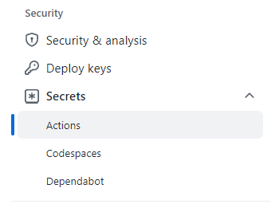

# LAB 1 - First deployment with CARML

In this lab you will have your first contact with a CARML module.

The objective of this lab is to understand what composes a module and the workflow that will make the module ready to be used.

## Step 1 - Create your fork

You can't work directly in the `main` branch. And even if you clone the CARML repository to be used at a customer, it's usually not a good idea.

The first action to be taken is to to _fork_ the repository.

> One of the fundamental features in version control systems, branching and forking are foundamentals to collaboration.
>
> A **branch** in Git creates another line of development in the project without affecting the main branch.
>
> **Fork**, on the other hand, is a clone of the repository on a different organization and you can do it even if you don't have contribution rights on the main repo.

1. Open to the repository via the URL [aka.ms/CARML](https://aka.ms/CARML)
   
    

1. Select the `Fork` button on the top right and select the organization you'd like to fork into. For this lab we recommend to use your own organization as this insures you will have all the permissions you need.

    

1. Once triggered, the repository will take a moment to be set up
   
    

1. Once done, you will automatically be forwarded to your repository 

    

## Step 2 - Configure your repository

Now you need to configure several secrets that are leveraged by the solution's workflows. Most notably for example, the service connection.

To do that you have to perform the following steps in sequence:

1. Navigate to the repository's `settings`

    

1. In the list of settings, navigate to `Secrets`. You can create a new repository secret by selecting `New repository secret` on the top right

    > With a new version of the website, the secret sections has been splitted to several sections, use the `Actions` one 

    

1. In the opening view, you can create a secret by providing a secret `Name`, a secret `Value`, followed by a click on the `Add secret` button

    

    The values of the secrets are the ones we collected in the [Azure setup](./PreReqAzure) tutorial. You'll need to create one secret for each entry in the following table and make sure you use the exact same naming:

    | Secret Name | Example | Description |
    | - | - | - |
    | `ARM_MGMTGROUP_ID` | `de33a0e7-64d9-4a94-8fe9-b018cedf1e05` | The group ID of the management group to test deploy modules of that level in. |
    | `ARM_SUBSCRIPTION_ID` | `d0312b25-9160-4550-914f-8738d9b5caf5` | The subscription ID of the subscription to test deploy modules of that level in. |
    | `ARM_TENANT_ID` | `9734cec9-4384-445b-bbb6-767e7be6e5ec` | The tenant ID of the tenant to test   deploy modules of that level in. |
    | `DEPLOYMENT_SP_ID` | `de33a0e7-64d9-4a94-8fe9-b018cedf1e05` | This is the Principal (Object ID)   for the Service Principal used as the Azure service connection. It is used for Default Role Assignments when Modules are being deployed into Azure |
    | `AZURE_CREDENTIALS` | See below | See below |
    <!-- | <s>PLATFORM_REPO_UPDATE_PAT</s> | - | For this lab, this secret is optional and can be **ignored**. It would be used to sync the repository's `docs` folder with the repository's wiki. However, for the sake of this lab   we will ignore it for now. If you are interested, you can find further information [here](https://github.com/Azure/ResourceModules/blob/main/docs/wiki/PipelinesDesign.md#github-component-github-secrets). | -->
  
    - Special case: `AZURE_CREDENTIALS`,
      This secret represents our service connection to Azure and its value is a compressed JSON object that must match the following format:

      ```JSON
      {"clientId": "<Application ID>", "clientSecret": "<Application Secret>", "subscriptionId": "<ID of the subscription to test in>", "tenantId": "<ID of the tenant to test in>" }
      ```

      Make sure you create this object as one continuous string as shown above - using the information you collected during the Azure setup. If you're interested, you can find more information about this object [here](https://github.com/Azure/login#configure-deployment-credentials).

## Step 3 - Modify a paramter file

We're just one step far from testing the first module.

We will now do a minor change to the parameter file of the `Public IP` module.
> Any module can be used at this stage, the public IP has been chosen because if excluding diagnostic settings, it has no external dependencies

1. Navigate to the following path `arm/Microsoft.Network/publicIPAddresses/.parameters/parameters.json`
1. Click on the `Edit` button

    

1. Remove or comment all the parameter values related to diagnostic settings

    

1. On the bottom of the page, choose `Create a new branch anda start a pull request` (optionally specify a commit message and description) than click on `Commit changes`.

    

1. Confirm the creation of the pull request.

## Step 4 - Test the module

After this preparation phase, we're sure you would like to see some Action(s)!

1. Click on `Actions`

    

1. Actions have been disabled for safty reasons on your fork, so you'll need to enable them

    

1. Look for the `Network: PublicIpAddresses` workflow
1. Select the `Run workflow` button. Make sure the selected branch is the one you created in the previous step and click on `Run workflow` on the bottom.

    

## Step 5 - Verify the workflow run correctly

Let's now see what happened.

First of all, if you click on the run, you should see jobs have run sccesfully.


> You will also notice the `Publish module` step has been skipped. This is because the workflows will only execute this job if run from the `main` branch, so that you do your test before the publishing happens.

You can also check the result on the Azure portal. You will notice that a resource group named `validation-rg` has been created. You can verify that new deployments happened in the Resource Group


> You can notice the resource group has no resources now. By default, the last step of the deployment will also remove what has been deployed, to keep the testing sanbox subscription cost as low as possible.
>
> You can modify this behaviour by unflagging `Remove deployed module` flag when running the workflow