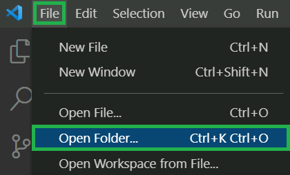
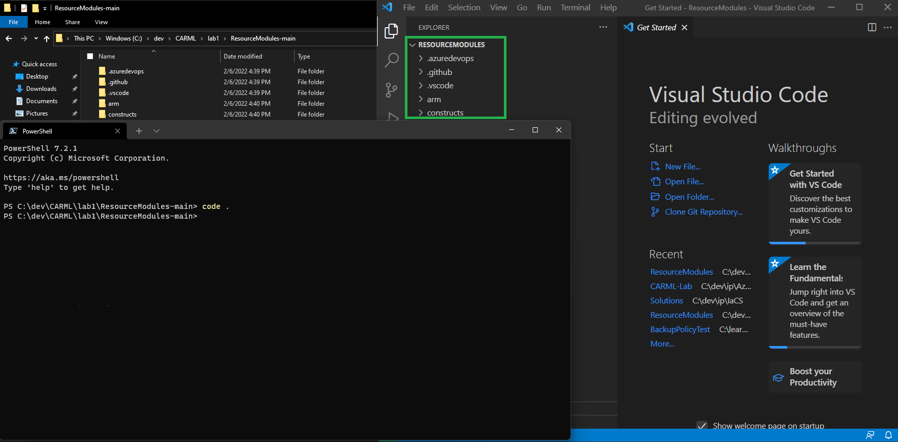
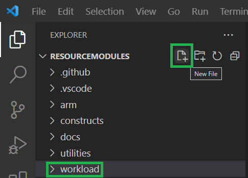
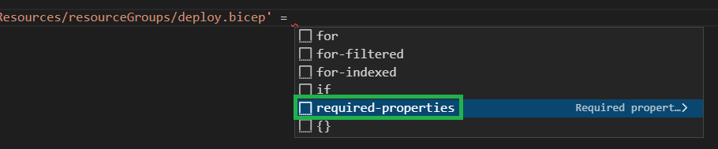

In this lab, you will learn how to use the modules that are currently available in the CARML library to build a basic, template-orchestrated solution - using local file paths.

### _Navigation_
- [Step 1 - Download the code base](#step-1---download-the-code-base)
- [Step 2 - Create solution file](#step-2---create-solution-file)
- [Step 3 - Build solution](#step-3---build-solution)
- [Step 4 - Stretch goal: Deploy solution](#step-4---stretch-goal-deploy-solution)
---

# Step 1 - Download the code base

To start building a solution / workload, you first have to get access to the code base. One of the ways to do so is to perform the following steps:

1. Open the repository via the URL [aka.ms/CARML](https://aka.ms/CARML)

    

1. On the overview page, select the `<> Code` button to the right, and select the `Download ZIP` button in the opening pop up to trigger the repository to be downloaded as a compressed file.

    

1. Following the download, navigate to the downloaded file and extract it to a location of your choice (for example `C:/dev/CARML/lab1`)

    

1. Next, we'd ask you to open the extracted folder in VSCode. You can achieve this in multiple ways:

    <details>
    <summary><b>Alternative 1:</b> Using VSCode</summary>

    1. Open Visual Studio Code and trigger the file explorer on the top left

        


    1. Navigate to the extracted folder, select it and trigger the `Select Folder` button 
       
       

    </details>

    <details>
    <summary><b>Alternative 2:</b> Using the Terminal</summary>

    1. Next, navigate to the inside of the extracted folder (e.g. `ResourceModules-main`), perform a right-click and select `Open in Windows Terminal` to open a new PowerShell session with the path set to the current folder

    1. Next, just type & execute the command `code .` to open Visual Studio Code in the extracted repository folder

        
    </details>

<p>

# Step 2 - Create solution file

In Visual Studio, the next step is to create the solution itself. To do so, perform the following steps:

1. Create a folder called `workload` in the root folder by selecting the small `New Folder` button on the top of the file explorer in VSCode

    

1. Then select the new folder and press the small `New File` button to the left of the previous `New Folder` button and name it `deploy.bicep`. This will be the folder where you create the workload.

    

# Step 3 - Build solution

Now, let's create the actual solution. In this first lab, we will start with a small setup to get rolling.

Fundamentally, we want you to deploy
- A Resource Group
- A Storage Account
- A Key Vault
- A Log Analytics Workspace

To set these up, please perform the following steps:

1. Open the created workload file in `workload/deploy.bicep`

1. As you will deploy a resource group, we first need to set the template scope to `subscription`. To do so, add the following line on the top of the file

   ```Bicep
   targetScope = 'subscription'
   ```

1. Next, add the following parameters to the template

    ```Bicep
    // ========== //
    // Parameters //
    // ========== //

    @description('Required. The name of the resource group to deploy')
    param resourceGroupName string = 'carml-rg'

    @description('Optional. The location to deploy into')
    param location string = deployment().location

    @description('Required. The name of the storage account to deploy')
    param storageAccountName string

    @description('Required. The name of the key vault to deploy')
    param keyVaultName string

    @description('Required. The name of the log analytics workspace to deploy')
    param logAnalyticsWorkspaceName string
    ```

1. Now, you will add the references to the individual CARML modules you will deploy. Let's start with the resource group. Underneath the parameters, add the following block

    ```Bicep
    // =========== //
    // Deployments //
    // =========== //

    module rg '../arm/Microsoft.Resources/resourceGroups/deploy.bicep' =
    ```

   The above snippet references the local path to the ResourceGroup CARML module. Thanks to Bicep's ability to resolve the reference, it should open a pop-up and ask you whether you want to auto-insert the `required parameters` (if it does not come up automatically, try to remove & add the `=`, or press `Ctrl + Space`). Press `Enter` to confirm. These parameters are the ones the Bicep module does not have default values for.

    

    Once confirmed, it will generate the following skeleton:

    ```Bicep
    module rg '../arm/Microsoft.Resources/resourceGroups/deploy.bicep' = {
     name:
        params: {
            name:
        }
    }
    ```

    As you can see, the module only requires you to provide a deployment `name` (that will be visible in the list of deployments in the portal), as well as a `name` in its parameter block - referring to the resource group name. Please add a deployment name of your choice and reference the `resourceGroupName` template parameter for the resource group `'name'` `param`. If you want to know what other parameters would be supported, feel free to check up on the module's `readme.md` that is located in the same folder as the template itself (for example `arm\Microsoft.Resources\resourceGroups\readme.md`).

    By default, the resource group is deployed into the same location as the deployment. For the sake of this lab, please add an additional parameter `location` in the `params` block of the module. Here you will reference the location that is defined as an input parameter in this template's parameter block above.

    Following you can find an example of how a complete reference would look like:

    ```Bicep
    module rg '../arm/Microsoft.Resources/resourceGroups/deploy.bicep' = {
        name: 'workload-rg'
        params: {
            name: resourceGroupName
            location: location
        }
    }
    ```

    Now, please fill in the parameters accordingly.

1. Following the same flow, please now go ahead and add the references to the `../arm/Microsoft.Storage/storageAccounts` CARML module underneath the resource group module. Once done, it should look similar to:

    ```Bicep
    module sa '../arm/Microsoft.Storage/storageAccounts/deploy.bicep' = {
        scope:
        name: 'workload-sa'
        params: {
            name: storageAccountName
        }
    }
    ```

    The part that is missing is the `scope`. As we want to deploy the storage account into the resource group above and as such into a resource group scope, we must set that reference in the storage account scope. To do so, complete the `scope:` line with

    ```Bicep
    scope: resourceGroup(resourceGroupName)
    ```

    > ***Note:*** In case you are wondering why we don't use `scope: rg` or `scope: rg.outputs.name` to reduce the dependency on the input parameter: Both variants are not (yet) supported in Bicep.
    
    > ***Note:*** If you're using the latest Bicep version, Linter will warn you to explicitly specify the location parameter. You can either comply and add the location parameter to each module deployment in the template, or ignore the warning.

    As there is no direct reference to the resource group deployment (which has to come first) you also have to add an explicit dependency to the mix. To do so, add the following snippet in between the two final closing brackets `}` of the storage account block:

    ```Bicep
    dependsOn: [
        rg
    ]
    ```

    The full module reference should now look like

    ```Bicep
    module sa '../arm/Microsoft.Storage/storageAccounts/deploy.bicep' = {
        scope: resourceGroup(resourceGroupName)
        name: 'workload-sa'
        params: {
            name: storageAccountName
        }
        dependsOn: [
            rg
        ]
    }
    ```

1. For the remaining two resources, Key Vault & Log Analytics Workspace, apply the same steps as you did for the storage account.

1. To also get some insights into the resources that are deployed, let's add some outputs as well. To do so, add the following lines to the end of the file:

    ```Bicep
    // ======= //
    // Outputs //
    // ======= //

    @description('The resource ID of the deployed resource group')
    output resourceGroupResourceId string = rg.outputs.resourceId

    @description('The resource ID of the deployed storage account')
    output storageAccountResourceId string = sa.outputs.resourceId

    @description('The resource ID of the deployed key vault')
    output keyVaultResourceId string = kv.outputs.resourceId

    @description('The resource ID of the deployed log analytics workspace')
    output logAnalyticsWorkspaceResourceId string = law.outputs.resourceId
    ```

1. In total, the final result should look similar to. When done, make sure to save the file.

    ```Bicep
    targetScope = 'subscription'

    // ================ //
    // Input Parameters //
    // ================ //

    @description('Required. The name of the resource group to deploy')
    param resourceGroupName string

    @description('Optional. The location to deploy into')
    param location string = deployment().location

    @description('Required. The name of the storage account to deploy')
    param storageAccountName string

    @description('Required. The name of the key vault to deploy')
    param keyVaultName string

    @description('Required. The name of the log analytics workspace to deploy')
    param logAnalyticsWorkspaceName string

    // =========== //
    // Deployments //
    // =========== //

    module rg '../arm/Microsoft.Resources/resourceGroups/deploy.bicep' = {
        name: 'workload-rg'
        params: {
            name: resourceGroupName
            location: location
        }
    }

    module sa '../arm/Microsoft.Storage/storageAccounts/deploy.bicep' = {
        scope: resourceGroup(resourceGroupName)
        name: 'workload-sa'
        params: {
            name: storageAccountName
        }
        dependsOn: [
            rg
        ]
    }

    module kv '../arm/Microsoft.KeyVault/vaults/deploy.bicep' = {
        scope: resourceGroup(resourceGroupName)
        name: 'workload-kv'
        params: {
            name: keyVaultName
        }
        dependsOn: [
            rg
        ]
    }

    module law '../arm/Microsoft.OperationalInsights/workspaces/deploy.bicep' = {
        scope: resourceGroup(resourceGroupName)
        name: 'workload-law'
        params: {
            name: logAnalyticsWorkspaceName
        }
        dependsOn: [
            rg
        ]
    }

    // ======= //
    // Outputs //
    // ======= //

    @description('The resource ID of the deployed resource group')
    output resourceGroupResourceId string = rg.outputs.resourceId

    @description('The resource ID of the deployed storage account')
    output storageAccountResourceId string = sa.outputs.resourceId

    @description('The resource ID of the deployed key vault')
    output keyVaultResourceId string = kv.outputs.resourceId

    @description('The resource ID of the deployed log analytics workspace')
    output logAnalyticsWorkspaceResourceId string = law.outputs.resourceId
    ```

# Step 4 - Stretch goal: Deploy solution

In this final step, we ask you to optionally perform a test deployment of the given template to ensure that everything works as intended. To do so, just perform the following steps:

1. Select the PowerShell `Terminal` that should be open on the lower end of VSCode. If `Terminal` is not in sight, you can alternatively open it by expanding the `Terminal`-dropdown on the top, and selecting `New Terminal`

    

1. Now, you have to run a few commands in succession. First, log into your Azure subscription by executing `Connect-AzAccount` and follow the process

1. Next, you can invoke the deployment itself. To do so, you can execute the following command using your own values for everything marked by _`<x>`_: 
    ```Powershell
    $inputObject = @{
        DeploymentName            = "CARML-workload-$(-join (Get-Date -Format 'yyyyMMddTHHMMssffffZ')[0..63])"
        TemplateFile              = '<FullPathToYourTemplateFile>' # Get the path via a right-click on the template file in VSCode & select 'Copy Path'
        Location                  = '<LocationOfYourChoice>' # E.g. WestEurope
        Verbose                   = $true
        resourceGroupName         = '<NameOfTheResourceGroup>' # E.g. workload-rg
        storageAccountName        = '<NameOfTheStorageAccount>' # Must be globally unique
        keyVaultName              = '<NameOfTheKeyVault>' # Must be globally unique
        logAnalyticsWorkspaceName = '<NameOfTheLogAnalyticsWorkspace>' # E.g. carml-law
    }
    New-AzSubscriptionDeployment @inputObject
    ```

    The resulting log should look similar to:

    ```Powershell
    PS C:\Desktop\CARML\ResourceModules> Connect-AzAccount

    Account          SubscriptionName TenantId                             Environment
    -------          ---------------- --------                             -----------
    carml@hotmail.de carml            00000000-0000-0000-0000-000000000000 AzureCloud

    PS C:\Desktop\CARML\ResourceModules> $inputObject = @{
    >>     DeploymentName            = "CARML-workload-$(-join (Get-Date -Format 'yyyyMMddTHHMMssffffZ')[0..63])"
    >>     TemplateFile              = 'C:\Desktop\CARML\ResourceModules\workload\deploy.bicep'
    >>     Location                  = 'WestEurope'
    >>     Verbose                   = $true
    >>     ResourceGroupName         = 'carml-rg'
    >>     StorageAccountName        = 'carmllabsa'
    >>     KeyVaultName              = 'carmlLabsakv'
    >>     logAnalyticsWorkspaceName = 'carmllaw'
    >> }
    PS C:\Desktop\CARML\ResourceModules> New-AzSubscriptionDeployment @inputObject
    VERBOSE: Using Bicep v0.4.1008
    VERBOSE:
    VERBOSE: 18:09:23 - Template is valid.
    VERBOSE: 18:09:25 - Create template deployment 'CARML-workload-20220202T1802526927Z'
    VERBOSE: 18:09:25 - Checking deployment status in 5 seconds
    VERBOSE: 18:09:30 - Resource Microsoft.Resources/deployments 'workload-rg' provisioning status is running
    VERBOSE: 18:09:30 - Resource Microsoft.Resources/resourceGroups 'carml-rg' provisioning status is succeeded
    VERBOSE: 18:09:31 - Checking deployment status in 14 seconds
    VERBOSE: 18:09:45 - Resource Microsoft.Resources/deployments 'workload-rg' provisioning status is succeeded
    VERBOSE: 18:09:45 - Resource Microsoft.Resources/deployments 'workload-rg' provisioning status is succeeded
    VERBOSE: 18:09:45 - Checking deployment status in 16 seconds
    VERBOSE: 18:10:02 - Resource Microsoft.Resources/deployments 'workload-kv' provisioning status is running
    VERBOSE: 18:10:02 - Resource Microsoft.Resources/deployments 'workload-sa' provisioning status is running
    VERBOSE: 18:10:02 - Resource Microsoft.Storage/storageAccounts 'carmllabsa' provisioning status is running
    VERBOSE: 18:10:02 - Resource Microsoft.Resources/deployments 'workload-law' provisioning status is running
    VERBOSE: 18:10:02 - Checking deployment status in 15 seconds
    VERBOSE: 18:10:18 - Resource Microsoft.Resources/deployments 'workload-sa' provisioning status is succeeded
    VERBOSE: 18:10:18 - Resource Microsoft.Storage/storageAccounts 'carmllabsa' provisioning status is succeeded
    VERBOSE: 18:10:19 - Resource Microsoft.KeyVault/vaults 'carmlLabsakv' provisioning status is running
    VERBOSE: 18:10:19 - Resource Microsoft.Resources/deployments 'workload-sa' provisioning status is succeeded
    VERBOSE: 18:10:19 - Resource Microsoft.OperationalInsights/workspaces 'carmllaw' provisioning status is running
    VERBOSE: 18:10:19 - Checking deployment status in 14 seconds
    VERBOSE: 18:10:34 - Resource Microsoft.Resources/deployments 'workload-kv' provisioning status is succeeded
    VERBOSE: 18:10:34 - Resource Microsoft.KeyVault/vaults 'carmlLabsakv' provisioning status is succeeded
    VERBOSE: 18:10:34 - Resource Microsoft.Resources/deployments 'workload-kv' provisioning status is succeeded
    VERBOSE: 18:10:34 - Checking deployment status in 14 seconds
    VERBOSE: 18:10:50 - Resource Microsoft.Resources/deployments 'workload-law' provisioning status is succeeded
    VERBOSE: 18:10:50 - Resource Microsoft.OperationalInsights/workspaces 'carmllaw' provisioning status is succeeded
    VERBOSE: 18:10:50 - Resource Microsoft.Resources/deployments 'workload-law' provisioning status is succeeded

    Id                : /subscriptions/00000000-0000-0000-0000-000000000000/providers/Microsoft.Resources/deployments/CARML-workload-20220202T1802526
    927Z
    DeploymentName    : CARML-workload-20220202T1802526927Z
    Get-Location      : westeurope
    ProvisioningState : Succeeded
    Timestamp         : 02.02.2022 17:10:47
    Mode              : Incremental
    TemplateLink      :
    Parameters        :
                        Name                         Type                      Value
                        =========================    ========================= ==========
                        resourceGroupName            String                    carml-rg
                        Get-location                 String                    WestEurope
                        storageAccountName           String                    carmllabsa
                        keyVaultName                 String                    carmlLabsakv
                        logAnalyticsWorkspaceName    String                    carmllaw

    Outputs           :
                        Name                              Type                      Value
                        ================================= ========================= ==========
                        resourceGroupResourceId           String                    /subscriptions/00000000-0000-0000-0000-000000000000/resourceGroups/carml-rg
                        storageAccountResourceId          String                    /subscriptions/00000000-0000-0000-0000-000000000000/resourceGroups/carml-rg/providers/Microsoft.Storage/storageAccounts/carmllabsa
                        keyVaultResourceId                String                    /subscriptions/00000000-0000-0000-0000-000000000000/resourceGroups/carml-rg/providers/Microsoft.KeyVault/vaults/carmlLabsakv
                        logAnalyticsWorkspaceResourceId   String                    /subscriptions/00000000-0000-0000-0000-000000000000/resourceGroups/carml-rg/providers/Microsoft.OperationalInsights/workspaces/carmllaw

    DeploymentDebugLogLevel :
    ```

---
---

If ready, proceed to the next lab: [Lab 2 - Setup CARML prerequisites](./Lab%202%20-%20Setup%20CARML%20prerequisites)
