In this lab, you will set up **CARML** in your own environment. This set-up can be used to mimic the module factory you can use at your customer, or to perform an end to end testing for contribution purposes.

### _Navigation_
- [Step 1 - Create Azure Service Principal and Configure Access to Subscription](#step-1---create-azure-service-principal-and-configure-access-to-subscription)
- [Step 2 - Create your fork](#step-2---create-your-fork)
- [Step 3 - Configure your repository](#step-3---configure-your-repository)
- [Step 4 - Configure code base](#step-4---configure-code-base)
- [Step 5 - Create a branch](#step-5---create-a-branch)
- [Step 6 - Enable actions](#step-6---enable-actions)

---

# Step 1 - Create Azure Service Principal and Configure Access to Subscription

CARML tests the deployments and stores the module artifacts in an Azure subscription. To do so, it requires a service principal with access to it.

This step will guide you in the creation of the Service Principal and the gathering of the required values that will be used in the next steps.

For this lab, it is enough to just write them temporarily in for example Notepad. You should have notes for the following pieces:

- Application ID
- Service Principal Object ID
- Service Principal Secret (password)
- Tenant ID
- Subscription ID
- Parent Management Group

There are two alternatives to execute this step. Please, choose the one you prefer and move to Step 2 afterwards.

<details>
<summary><b>Alternative 1: Using Az CLI command</b></summary>

The following commands will allow us to:

- Login to Azure using Az CLI.
- Create a new Service Principal.
- Assign the Service Principal `Owner` role at subscription level.

> If you don't want to give Owner permissions to the Service Principals other options will be provided as part of the steps.

1. As a first step, in the Azure portal, you have to navigate to your subscription by using for example the search bar on the top.

    

1. Following, select the subscription you want to grant access to. In the below example it is called `Visual Studio Enterprise Subscription`.

    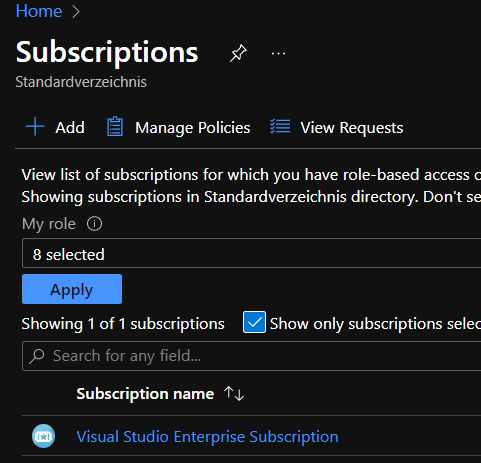

1. This brings you to the overview of your subscription. Here you need to perform 2 tasks:
   - Make note of the `Subscription ID` for later reference
   - Make note of the `Parent Management Group` for later reference

    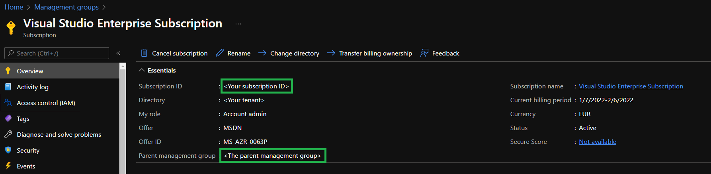

1. Navigate back to your local Visual Studio Code and select the PowerShell `Terminal` that should be open on the lower end of VSCode. If `Terminal` is not in sight, you can alternatively open it by expanding the `Terminal`-dropdown on the top, and selecting `New Terminal`.

1. Now, login to Azure by executing:

```PowerShell
az login 
```

1. Select the right subscription you want to work in by executing the following command. Update the `<subscription id>` with your Subscription Id. This will start an interactive login session opening your default web browser.

```Powershell
az account set --subscription "<subscription id>"
```

1. Create a new Service Principal with `Owner` permissions at subscription level by executing the following command:

```Powershell
az ad sp create-for-rbac --name "<<service-principal-name>>" --role "Owner" --output "json"
```

If you don't want to assign **Owner**, you can also choose **Contributor** in combination with **User Access Administrator**. For this second role assignment you will need to execute the following command:

```Powershell
az role assignment create --assignee "<<service-principal-name>>" --role "User Access Administrator".
```

1. The below output will be returned when the service principal has been created. Make sure you copy these values in a Notepad, for instance.

```JSON
{
  "appId": "<client_id>",
  "displayName": "<service-principal-name>",
  "name": "http://<service-principal-name>",
  "password": "<client_secret>",
  "tenant": "<tenant_id>"
}
```

1. Lastly, you need to gather the Object Id of the Service Principal you just created. You can do so by executing the following command:

```Powershell
az ad sp list --display-name "<service-principal-name>" --query "[].objectId" --output tsv
```

</details>


<details>
<summary><b>Alternative 2: Using the Azure Portal</b></summary>

### Create the Service Principal

1. Open the Azure Portal via the URL [https://portal.azure.com](https://portal.azure.com)

    

1. Navigate to Azure Active Directory (Azure AD) by using for example the search bar on the top.

    

1. Here we want to do 2 things:
   - Make note of your `Tenant ID` in the displayed `Overview` for later reference
   - Further select `App registrations` in the blade to the left

    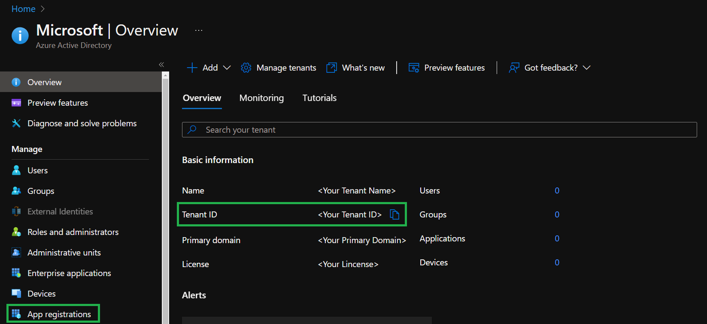

1. In the opening view select `+ New registration` on the top.

    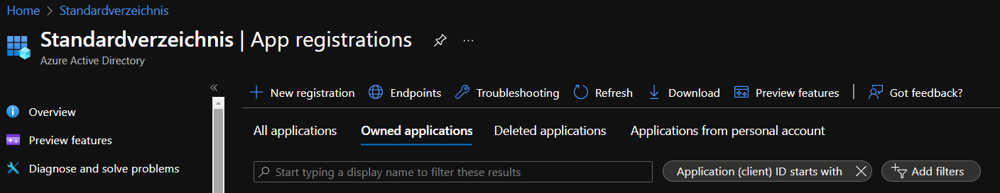

1. In the opening form, please provide a name of your choice and select `Register`. All other options can remain as is.

    

1. This will open the created application's overview. Here we again want to do 2 things:
   - Make note of the `Application (client) ID` for later reference
   - Navigate to the application's underlying service principal by selecting its name on the right side of the application's overview

    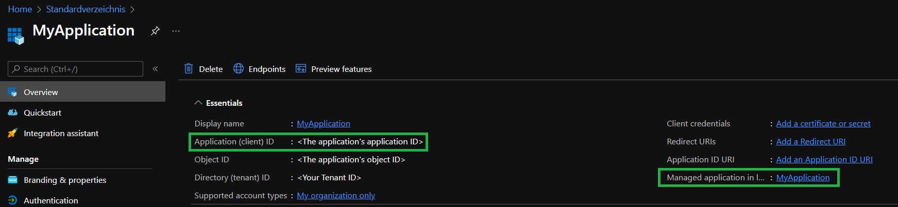

1. Here you have to perform 2 tasks:
   - Make note of the service principal's `Object ID`    for later reference
   - Further, navigate back to the created application's overview by going back in your browser

    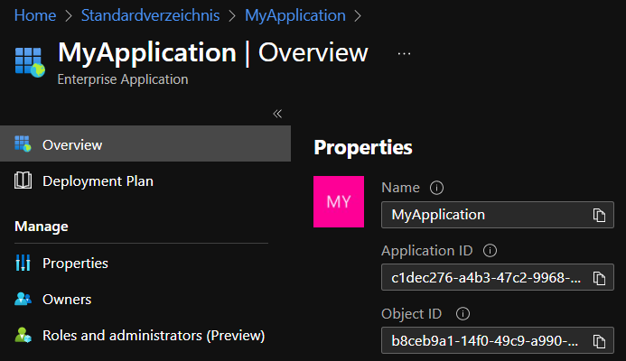

1. Back on the application, you again have to perform 2 tasks:
   - Select `Certificates & secrets` in the blade to the left
   - Select `+ New client secret` in the opening view to the right

    

1. Now enter a name for the secret, and click on `Add`.

    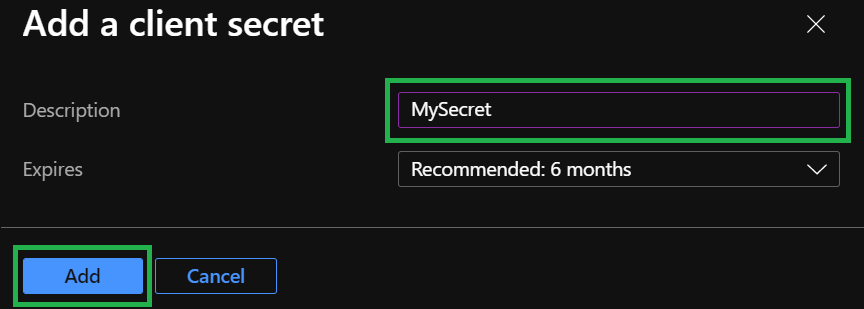

1. The previous step created a new secret for the application which is shown to us now. Please make note of the secret value as it will only be visible until we leave this view.

    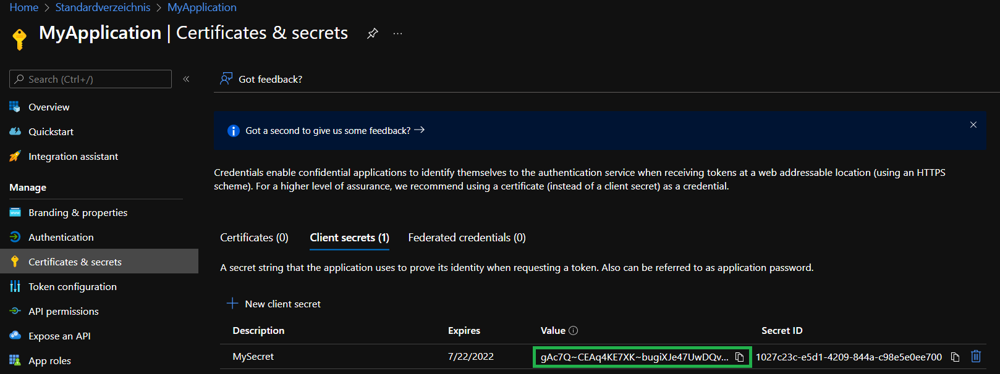

### Grant Service principal access to subscription

Now that we have a new service principal, we must grant it access on the subscription we want to test later deployments in.

1. As a first step, you have to navigate to your subscription by using for example the search bar on the top.

    

1. Following, select the subscription you want to grant access to. In the below example it is called `Visual Studio Enterprise Subscription`.

    

1. This brings you to the overview of your subscription. Here you need to perform 3 tasks:
   - Make note of the `Subscription ID` for later reference
   - Make note of the `Parent Management Group` for later reference
   - Further select  `Access control (IAM)` in the blade to the left

    

1. In the opened `Access control (IAM)` view, select `+ Add` on the top.

    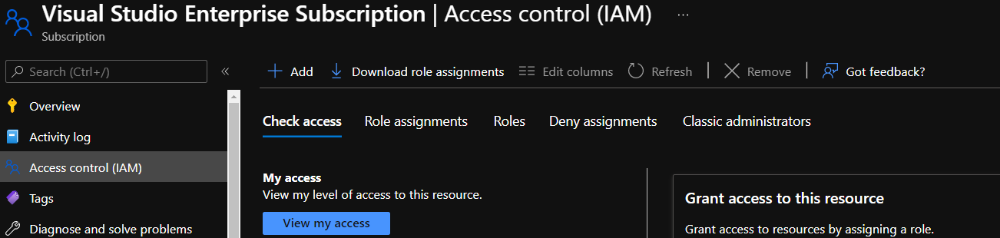

1. In the opening drop-down, select `Add role assignment`.

    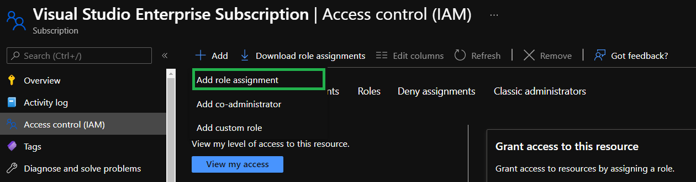

1. This opens a new view with 3 tabs we have to navigate through. First, you must select the `Role` we want to assign. For this lab we recommend to use the `Owner` role, as the CI platform tests both resource deployments, as well as role assignments. If you don't want to assign `Owner`, you can also choose `Contributor` in combination with `User Access Administrator`. In either case, you can use the search to search for the roles you want to assign and select them in the list below it.

    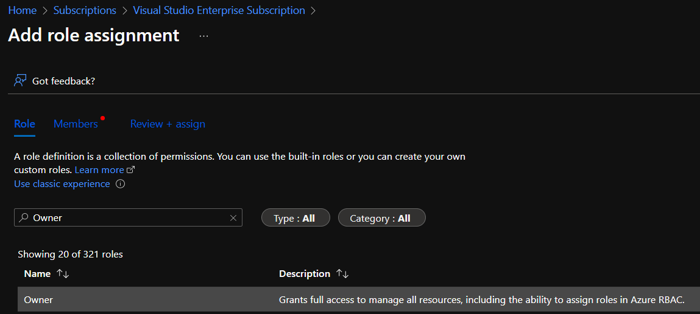

1. Next, navigate to the `Members` tab and click on `+ Select members`.

    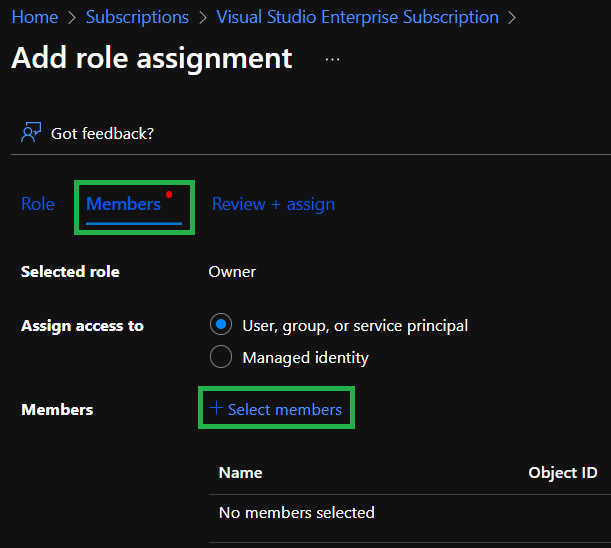

1. In the opening blade, search for the name of the application you created (in this example it is `MyApplication`), make sure you **select** the application, and click on `Select` on the bottom of the blade.

    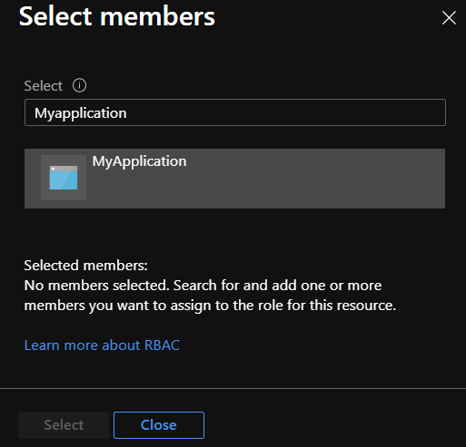

1. This will close the blade and show the application in the `Members` view as shown in the image below.

    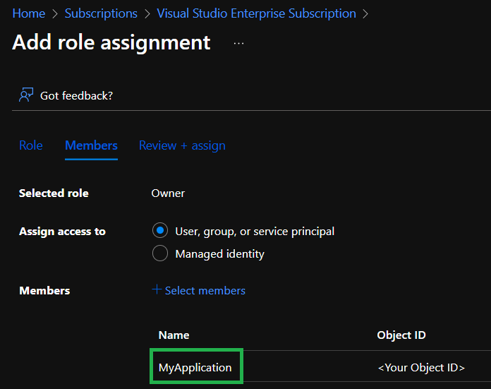

1. Finally, select the `Review + assign` tab which shows you an overview of the configuration and click on the `Review + assign` button on the bottom to conclude the role assignment.

    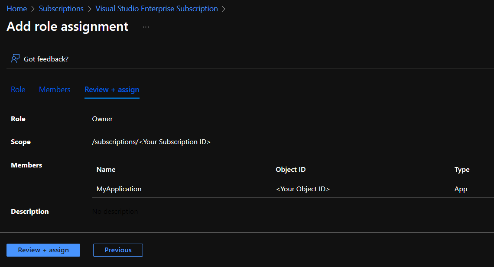

1. This will close the view and we can confirm that the role assignment worked by searching for the application in the search and selecting your application in the `Check access` section. Be aware that it may take a few seconds for the role assignment to finish.

    

1. In the opening blade you can see that the application indeed is configured with the expected role(s) for the current subscription.

    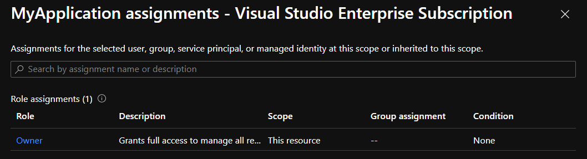

</details>

<p>

# Step 2 - Create your fork

In **CARML**, you can't work directly in the `main` branch, so the first action to be taken is to to _fork_ the repository.

> One of the fundamental features in version control systems, branching and forking are fundamentals to collaboration.
>
> A **branch** in Git creates another line of development in the project without affecting the main branch.
>
> **Fork**, on the other hand, is a clone of the repository on a different organization and you can do it even if you don't have contribution rights on the main repo.

1. Open to the repository via the URL [aka.ms/CARML](https://aka.ms/CARML)

    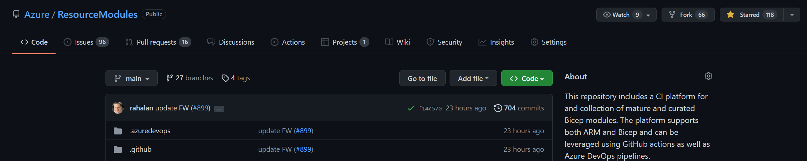

1. Select the `Fork` button on the top right and select the organization you'd like to fork into. For this lab we recommend to use your own organization as this ensures you will have all the permissions you need.

    

1. Once triggered, the repository will take a moment to be set up.

    

1. Once done, you will automatically be forwarded to your repository.

    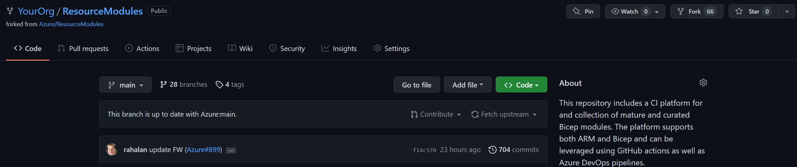

# Step 3 - Configure your repository

Now you need to configure several secrets that are leveraged by the solution's workflows. Most notably for example, the service connection.

To do that you have to perform the following steps in sequence:

1. Navigate to the repository's `Settings`.

    

1. In the list of settings, expand `Secrets` and select `Actions`. You can create a new repository secret by selecting `New repository secret` on the top right.

    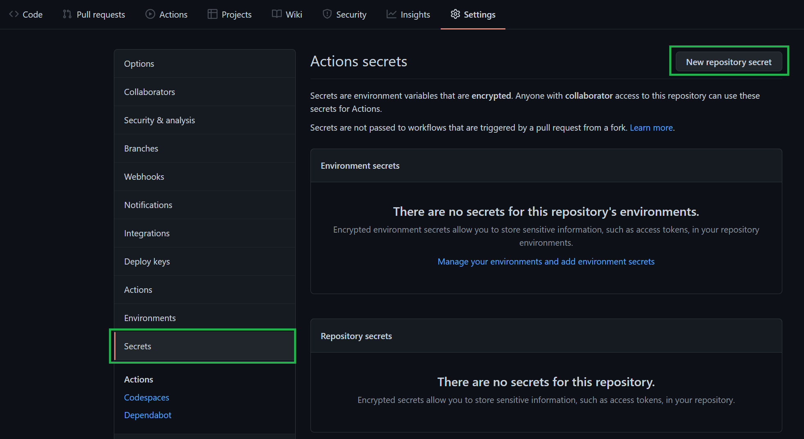

2. In the opening view, you can create a secret by providing a secret `Name`, a secret `Value`, followed by a click on the `Add secret` button.

    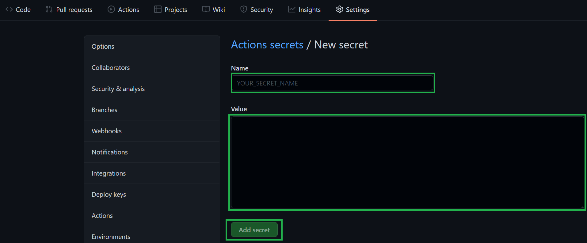

    The values of the secrets are the ones we collected in [Step 1](#step-1---create-azure-service-principal-and-configure-access-to-subscription) of this lab. You'll need to create one secret for each entry in the following table and make sure you use the exact same naming:

    | Secret Name | Example | Description |
    | - | - | - |
    | `ARM_MGMTGROUP_ID` | `de33a0e7-64d9-4a94-8fe9-b018cedf1e05` / `my-mg` | The group ID of the management group to test deploy modules of that level in. |
    | `ARM_SUBSCRIPTION_ID` | `d0312b25-9160-4550-914f-8738d9b5caf5` | The subscription ID of the subscription to test deploy modules of that level in. |
    | `ARM_TENANT_ID` | `9734cec9-4384-445b-bbb6-767e7be6e5ec` | The tenant ID of the tenant to test   deploy modules of that level in. |
    | `DEPLOYMENT_SP_ID` | `de33a0e7-64d9-4a94-8fe9-b018cedf1e05` | This is the Principal (Object ID)   for the Service Principal used as the Azure service connection. It is used for Default Role Assignments when Modules are being deployed into Azure |
    | `AZURE_CREDENTIALS` | See below | See below |
    <!-- | <s>PLATFORM_REPO_UPDATE_PAT</s> | - | For this lab, this secret is optional and can be **ignored**. It would be used to sync the repository's `docs` folder with the repository's wiki. However, for the sake of this lab we will ignore it for now. If you are interested, you can find further information [here](https://github.com/Azure/ResourceModules/blob/main/docs/wiki/PipelinesDesign.md#github-component-github-secrets). | -->
  
    - Special case: `AZURE_CREDENTIALS`,
      This secret represents our service connection to Azure and its value is a compressed JSON object that must match the following format:

      ```JSON
      {"clientId": "<Application ID>", "clientSecret": "<Application Secret>", "subscriptionId": "<ID of the subscription to test in>", "tenantId": "<ID of the tenant to test in>" }
      ```

      Make sure you create this object as one continuous string as shown above - using the information you collected during Step 1 of this lab. If you're interested, you can find more information about this object [here](https://github.com/Azure/login#configure-deployment-credentials).

# Step 4 - Configure code base

As the platform tests services in Azure, you have to ensure that those services with globally unique naming requirements are set up accordingly. This must happen in two places:

- The individual module parameter files
- The shared dependency pipeline

The platform, by default, will publish the modules on _Azure Container Registry_, that also requires a globally unique name. You will need to set a unique name for it too.

## Clone the repository

To perform these changes as quickly and easily as possible, we recommend to update the code base using a local clone of the code in Visual Studio Code (VSCode). To do so, please perform the following steps:

1. On the overview page of your fork, select the `<> Code` button to the right, and select the copy button in the opening pop up to copy the URL we need to clone the repository.

    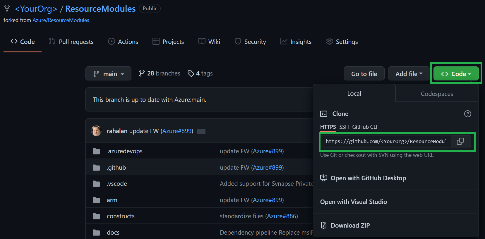

1. On your local machine you can clone the repository to any location you desire. However, it is recommended to create for example the folder structure `C:/dev/CARML/lab` to keep the local file paths short.

    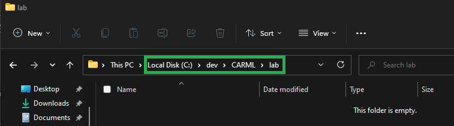

1. In the folder you chose, perform a right-click and select `Open in Windows Terminal` to open a new PowerShell session with the path set to the current folder.

    

1. In the terminal type `git clone '<URL>'`, replace `<URL>` with the URL you copied before and confirm the execution.

    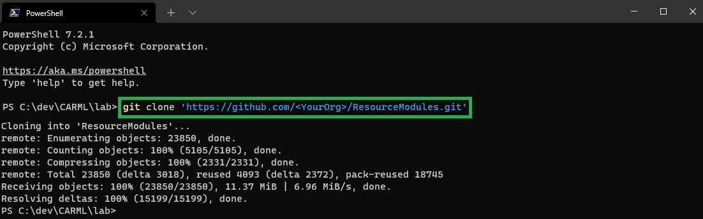

1. Following the execution you will find that there is now a `ResourceModules` folder.

    

1. Next, back in the terminal, execute the command `code ./ResourceModules` to open Visual Studio Code in the clone repository folder.

    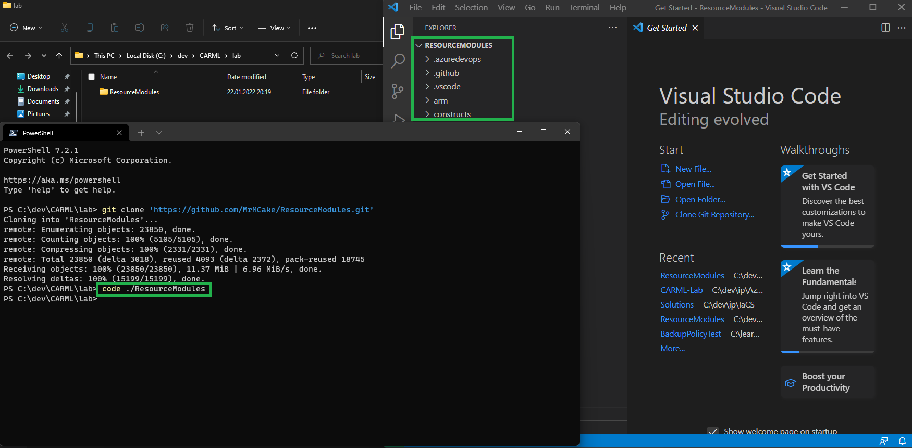

##   Prepare the default prefix 

To lower the barrier to entry and allow users to easily define their own naming conventions, we introduced a default "name prefix" for resources that must be set during the solution setup.

Each pipeline in CARML that deploys resources uses a logic that automatically replaces "tokens" (i.e. placeholders). Token values are stored in a central location to facilitate maintenance.

To complete this section perform the following steps:

1. Open the `settings.json` file in the repository root directory. This is where the "name prefix" mentioned above is stored.

1. Replace the `"value": "<replace>"` of token `namePrefix` to a different value. Our recommendation is to use a triple like the first letter of your first name, and the first two letters of your second name. For example `Max Mustermann` would result into `mmu`.

    ```json
    {
        "parameterFileTokens": {
            (...)
            "localTokens": [
                {
                    "name": "namePrefix",
                    "value": "<replace>"
                }
            ]
        }
    }
    ```

    > **NOTE:** As the prefix is also used for all those resources that require a globally unique name, you should choose a value that is likewise unlikely to be already used somewhere. At the same time, the value should not be too long, as some resources have length restrictions.

##   Set the container registry unique name

As said above, the Bicep Registry needs a globally unique name, so you will need to use something that's different from the one cloned from the public CARML repository. To change it

1. Open the `.github/variables/global.variables.json` file.
1. Find the `bicepRegistryName` variable and modify its value (where `<put your unique name here>` is in the example). The registry name must be unique within Azure, and contain 5-50 alphanumeric characters.

    ```json
    {
        "name": "bicepRegistryName",
        "value": "<put your unique name here>"
    },
    ```

## Commit your changes to main

You now need to push the changes in the repo. You can do this in two ways:


<details>
<summary><b>Via VSCode's terminal</b></summary>

1. If Terminal is not in sight, you can alternatively open it by expanding the `Terminal`-dropdown on the top, and selecting `New Terminal` 
    
1. Now, execute the following PowerShell commands:

    ```PowerShell
    git add .
    git commit -m 'Update settings and variables'
    git push
    ```
    
</details>

<details>
<summary><b>Via VSCode's UI</b></summary>

1. Add your changes: If not already there, navigate to the source control menu to the left and add the changed files to the commit. To do so, select the `+` icon next to `Changes` (appears when hovering)

    

1. Commit your changes: Next, you should give the commit a meaningful message such as 'Update settings and variables' and can then click the checkmark symbol on the top to create the commit

    

1. Push your changes: Finally, you can push the changes to the repository by selecting the blue `Publish Branch` button

    

</details>

<p>

# Step 5 - Create a branch

By default, CARML uses pipeline triggers to automate for example the publishing of a new module once a corresponding PR is merged.

To this end, the trigger is set up to look for any changes in the `main` branch if any module or pipeline file was modified.

As you don't want to accidentally trigger any pipelines, you should hence create a branch to perform your tasks on throughout the rest of the lab.

You can do this in one of two ways:

<details>
<summary><b>Via VSCode's terminal</b></summary>

1. If Terminal is not in sight, you can alternatively open it by expanding the `Terminal`-dropdown on the top, and selecting `New Terminal` 
    
1. Now, execute the following PowerShell commands:

    ```PowerShell
    git checkout -b 'carmlLab'
    git push --set-upstream 'origin' 'carmlLab'
    ```
</details>

<details>
<summary><b>Via VSCode's UI</b></summary>

1. Select the current branch on the bottom left of VSCode

     

1. Select `+ Create new branch` in the opening dropdown

     

1. Enter the new branch name `carmlLab`


     

1. Push the new branch to your GitHub fork by selecting `Publish Branch` to the left in the 'Source Control' tab

    

</details>

<p>

# Step 6 - Enable actions

Finally, the 'GitHub Actions' are disabled by default. Hence, in order to continue with the rest of the lab and execute any pipelines you have to enable them first.

To do so, perform the following steps:

1. Navigate to the `Actions` tab on the top of the repository page.

    

1. Next, select '`I understand my workflows, go ahead and enable them`'.

    
    
---
---

If ready, proceed to the next lab: [Lab 3 - Deploy Dependencies](./Lab%203%20-%20Deploy%20Dependencies)
