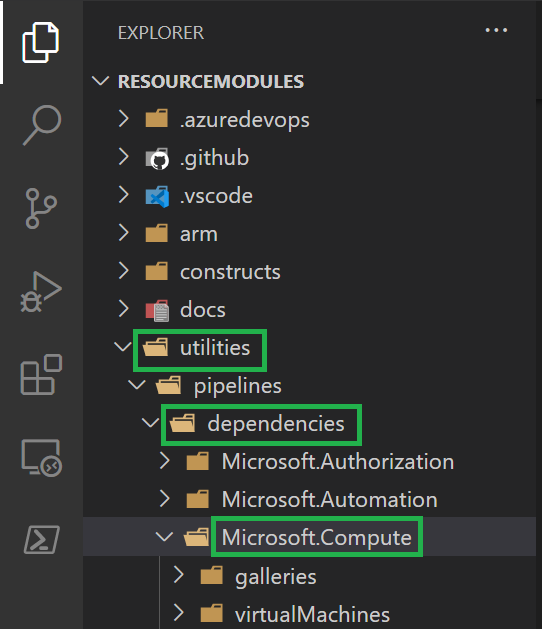
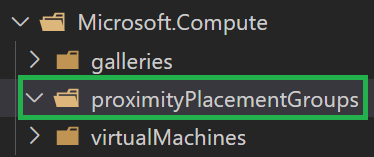
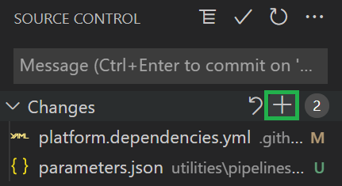
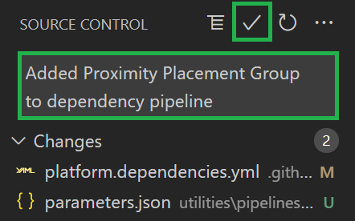
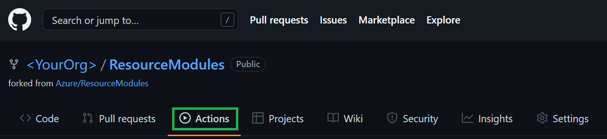

In order to successfully deploy and test all modules in your desired environment some modules have to have resources deployed beforehand. In this lab you will deploy the modules' dependencies by manually triggering the **dependency pipeline**.

### _Navigation_
- [Step 1 - Add a dependency resource parameter](#step-1---add-a-dependency-resource-parameter)
- [Step 2 - Update the dependency workflow](#step-2---update-the-dependency-workflow)
- [Step 3 - Upload your changes to GitHub](#step-3---upload-your-changes-to-github)
- [Step 4 - Trigger the dependency pipeline](#step-4---trigger-the-dependency-pipeline)
- [Step 5 - Understand the dependency pipeline](#step-5---understand-the-dependency-pipeline)

---

# Step 1 - Add a dependency resource parameter

Dependency resource parameters are hosted by the `utilities\pipelines\dependencies` subfolder. Under that, the relative path to the dependency resource folder is consistent with its resource type.
>Example: The folder hosting key vault resources is `utilities\pipelines\dependencies\Microsoft.KeyVault\vaults` since the key vault resource type is `Microsoft.KeyVault\vaults`

As part of a later lab you will need an additional dependency, a proximity placement group, that is currently not part of the dependency pipeline. For this purpose, perform the following tasks to add the new dependency.

1. The resource type of the proximity placement group resource is `Microsoft.Compute\proximityPlacementGroups`. In your local VSCode, navigate to the dependencies compute folder `utilities\pipelines\dependencies\Microsoft.Compute`

    

1. Add a new folder `proximityPlacementGroups`

    

1. Add another nested folder called `parameters`. This folder hosts all parameter files you would use to deploy proximity placement group dependencies.

1. In the parameters folder, add a new parameter file `parameters.json`. This file hosts the minimum parameters you need to deploy the dependency.

    

   > ***Note:*** The file's full path should match `utilities\pipelines\dependencies\Microsoft.Compute\proximityPlacementGroups\parameters\parameters.json`. 

1. Add the below snippet to the file

    ```json
    {
        "$schema": "https://schema.management.azure.com/schemas/2019-04-01/deploymentParameters.json#",
        "contentVersion": "1.0.0.0",
        "parameters": {
            "name": {
                "value": "adp-<<namePrefix>>-az-ppg-x-001"
            }
        }
    }
    ```

# Step 2 - Update the dependency workflow

Together with the resource modules pipelines, we are providing a dependency pipeline (GitHub workflow: `.github\workflows\platform.dependencies.yml`), leveraging resource parameters from the `utilities\pipelines\dependencies` subfolder. 

> ***Note:*** If this was a contribution to the main CARML repository, we would ask you to perform the same update to the Azure DevOps dependency pipeline  

1. Navigate to the dependency pipeline in path `.github\workflows\platform.dependencies.yml`

    

1. Add the below snippet in between the `job_deploy_rg` & `job_deploy_msi` job in line 62. You can add spaces as you see fit. 
   > ***Note:*** YAML is space-sensitive. Make sure the snippet uses the same indent as the other jobs. 
   
    ```Yaml
    job_deploy_ppg:
      runs-on: ubuntu-20.04
      name: 'Deploy proximity placement group'
      env:
        namespace: 'Microsoft.Compute\proximityPlacementGroups'
      needs:
        - job_deploy_rg
      strategy:
        fail-fast: false
        matrix:
          parameterFilePaths: ['parameters.json']
      steps:
        - name: 'Checkout'
          uses: actions/checkout@v2
          with:
            fetch-depth: 0
        - name: 'Deploy module'
          uses: ./.github/actions/templates/validateModuleDeployment
          with:
            templateFilePath: 'arm/${{ env.namespace }}/deploy.bicep'
            parameterFilePath: '${{ env.dependencyPath }}/${{ env.namespace }}/parameters/${{ matrix.parameterFilePaths }}'
            location: '${{ env.defaultLocation }}'
            resourceGroupName: '${{ env.defaultResourceGroupName }}'
            subscriptionId: '${{ secrets.ARM_SUBSCRIPTION_ID }}'
            managementGroupId: '${{ secrets.ARM_MGMTGROUP_ID }}'
            removeDeployment: '${{ env.removeDeployment }}'
   ``` 

# Step 3 - Upload your changes to GitHub

Now that the new dependency is implemented, you can upload your changes to GitHub. 

 This can either be done via the terminal or by using the Git integration of VSCode:


<details>
<summary><b>Alternative 1: Via VSCode's terminal</b></summary>

1. If a Terminal is not in sight, you can alternatively open it by expanding the `Terminal`-dropdown on the top, and selecting `New Terminal` 
    
1. Now, execute the following PowerShell commands:

    ```PowerShell
    git add .
    git commit -m 'Added Proximity Placement Group to dependency pipeline'
    git push
    ```
    
</details>

<details>
<summary><b>Alternative 2: Via VSCode's UI</b></summary>

1. Add your changes: If not already there, navigate to the source control menu to the left and add the changed files to the commit. To do so, select the `+` icon next to `Changes` (appears when hovering)

    

1. Commit your changes: Next, you should give the commit a meaningful message such as 'Added Proximity Placement Group to dependency pipeline' and can then click the checkmark symbol on the top to create the commit

    

1. Push your changes: Finally, you can push the changes to the repository by selecting the blue `Publish Branch` button

    

</details>

# Step 4 - Trigger the dependency pipeline

Usually, the dependency workflow would not run frequently, but only when new module dependencies are identified or its original state must be recovered. Therefore, the type of trigger that has been configured is the `workflow_dispatch`, which allows us to manually trigger the workflow when needed.

1. In the repository menu open the `Actions` tab.

    

1. From the workflows list, select the one named `.Platform: Dependencies`.
    
    

1. To the right, you will see a `Run workflow` button. Click on it, select your branch from the branch dropdown menu and trigger the workflow by clicking on the green button `Run workflow`.

    

    > For the sake of saving time in the lab, we will leave the SQL Managed Identity and VHD check boxes **unchecked**.

1. After running the workflow, if you wait a few seconds or refresh the page, you will see that a new execution is in progress.

    

1. You will verify that the workflow has finished once the status is green.

    


> This workflow may take up to 30 minutes to execute. You can proceed with the following steps and labs and revisit the pipeline later to make sure it succeeded.

# Step 5 - Understand the dependency pipeline

In order to successfully deploy and test all modules in your desired environment some modules have to have resources deployed beforehand. Since also dependency resources are in turn subject to dependencies with each other, resources are deployed in the following grouped order.

**First level resources**: resource groups leveraged by all modules. One instance is deployed:
- `validation-rg`: The resource group to which resources are deployed by default during the test deployment phase. This same resource group is also the one hosting the dependencies.

**Second level resources**: This group of resources has a dependency only on the resource group which will host them. Resources in this category include a log analytics workspace, storage account, event hub namespace, etc.
> ***Note:*** This group contains the previously added Proximity Placement group

**Third level resources**: This group of resources has a dependency on one or more resources in the group above. In this group we can find a key vault, recovery services vault, application insights, etc.

**Fourth level resources**: This group of resources has a dependency on one or more resources in the groups above. These resources include some virtual networks and a AVD application group.

Finally, the **fifth level resources** are resources with dependency on all the other groups. They include a virtual machine and a private DNS zone.


---
---

If ready, proceed to the next lab: [Lab 4 - First pipeline run](./Lab%204%20-%20First%20pipeline%20run)
