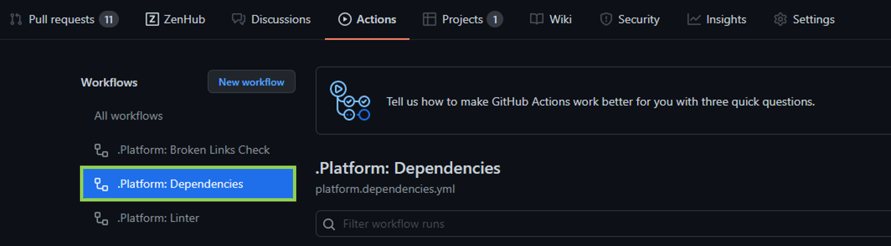
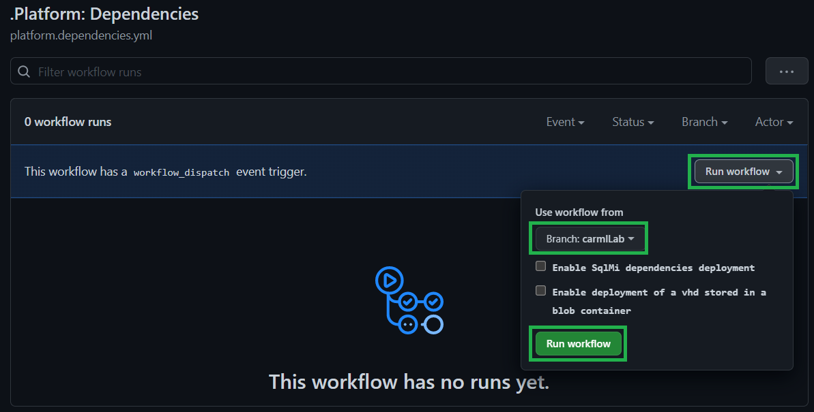
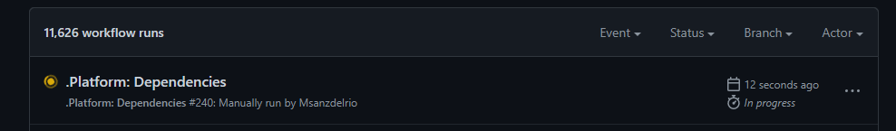
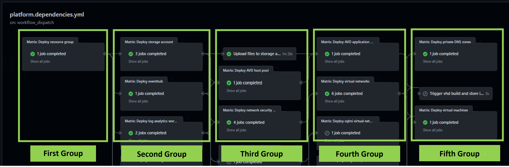

In order to successfully deploy and test all modules in your desired environment some modules have to have resources deployed beforehand. In this lab you will deploy the modules' dependencies by manually triggering the **dependency pipeline**.

### _Navigation_
- [Step 1 - Trigger the dependency pipeline](#step-1---trigger-the-dependency-pipeline)
- [Step 2 - What you will deploy](#step-2---what-you-will-deploy)

---

# Step 1 - Trigger the dependency pipeline

Together with the resource modules pipelines, we are providing a dependency pipeline (GitHub workflow: `.github\workflows\platform.dependencies.yml`), leveraging resource parameters from the `utilities\dependencies subfolder`. Ideally this workflow should not be running frequently, only when new module dependencies are identified. Therefore, the type of trigger that has been configured is the `workflow_dispatch`, which allows us to manually trigger the workflow when needed.

1. In the repository menu open the `actions` tab.

    

1. From the workflows list, select the one named `.Platform: Dependencies`.
    
    

1. To the right, you will see a `Run workflow` button. Click on it, select your branch from the branch dropdown menu and trigger the workflow by clicking on the green button `Run workflow`.

    

> For the sake of saving time in the lab, we will leave the SQL Managed Identity and VHD check boxes **unchecked**.

1. After running the workflow, if you wait a few seconds or refresh the page, you will see that a new execution is in progress.

    

1. You will verify that the workflow has finished once the status is green.

    

> This workflow may take up to 20 minutes to execute. You can proceed with the following steps and labs and revisit the pipeline later to make sure it succeeded.

# Step 2 - What you will deploy

In order to successfully deploy and test all modules in your desired environment some modules have to have resources deployed beforehand. Since also dependency resources are in turn subject to dependencies with each other, resources are deployed in the following grouped order.

**First level resources**: resource groups leveraged by all modules. Multiple instances are deployed:
     - 'validation-rg': The resource group to which resources are deployed by default during the test deployment phase. This same resource group is also the one hosting the dependencies.
     - 'artifacts-rg': The resource group to which templates are published during the publishing phase.

**Second level resources**: This group of resources has a dependency only on the resource group which will host them. Resources in this category include a log analytics workspace, storage account, event hub namespace, Azure container registry, etc.

**Third level resources**: This group of resources has a dependency on one or more resources in the group above. In this group we can find a key vault, recovery services vault, application insights, etc.

**Fourth level resources**: This group of resources has a dependency on one or more resources in the groups above. These resources include some virtual networks and a AVD application group.

Finally, the **fifth level resources** are resources with dependency on all the other groups. They include a virtual machine and a private DNS zone.

--> [Now proceed to the next LAB](./Lab4FirstModule) -->