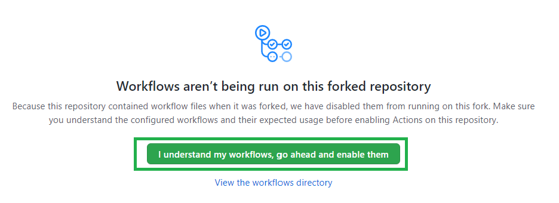
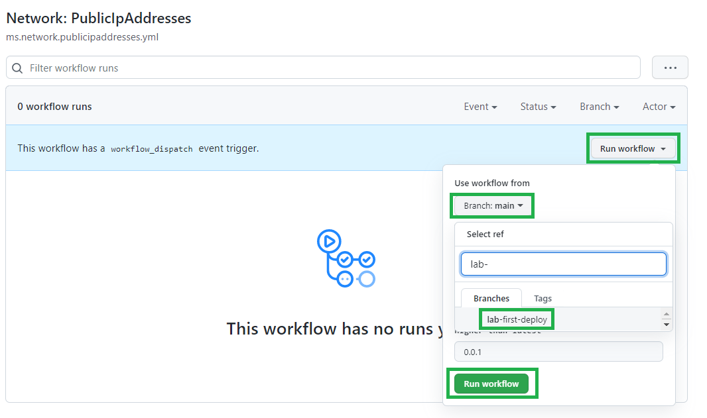
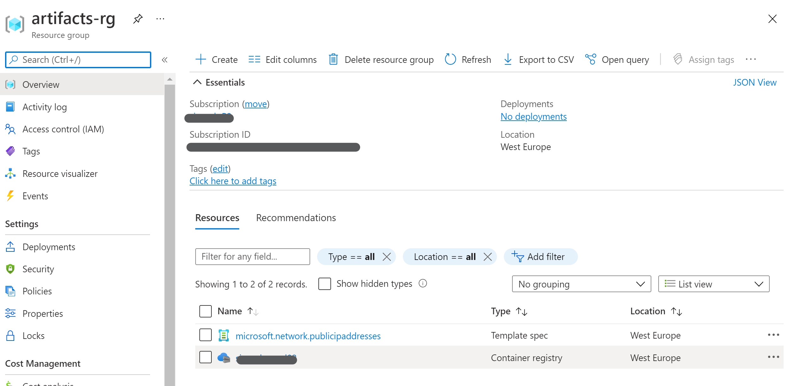

In this LAB you will explore how a module is tested and published.

This is how you will add/modify a module on your library and provide it to your company/customer for reuse.

### _Navigation_
- [Step 1 - Modify a parameter file](#Step-1---Modify-a-parameter-file)
- [Step 2 - Test the module](#Step-2---Test-the-module)
- [Step 3 - Build solution](#Step-3---Build-solution)
- [Step 4 - Merge the pull request](#Step-4---Merge-the-pull-request)
- [Step 5 - Verify publishing results](#Step-5---Verify-publishing-results)
---

# Step 1 - Modify a parameter file

We're almost ready to test the first module, but first you will now do a minor change to the parameter file of the `Public IP` module.
> Any module can be used at this stage, the public IP has been chosen because if excluding diagnostic settings, it has no external dependencies

1. Navigate to the following path `arm/Microsoft.Network/publicIPAddresses/.parameters/parameters.json`
1. Click on the `Edit` button

    

1. Remove or comment all the parameter values related to diagnostic settings

    

1. On the bottom of the page, choose `Create a new branch anda start a pull request` (optionally specify a commit message and description) than click on `Commit changes`.

    

1. Confirm the creation of the pull request.

# Step 2 - Test the module

After this preparation phase, we're sure you would like to see some Action(s)!

1. Click on `Actions`

    

<!-- 1. **??? TODO See if this has been enabled by dependencies in previous LAB ???** Actions have been disabled for safty reasons on your fork, so you'll need to enable them

     -->

1. Look for the `Network: PublicIpAddresses` workflow
1. Select the `Run workflow` button. Make sure the selected branch is the one you created in the previous step and click on `Run workflow` on the bottom.

    

# Step 3 - Verify the workflow run correctly

Let's now see what happened.

First of all, if you click on the run, you should see jobs have run sccesfully.

> You will also notice the `Publish module` step has been skipped. This is because the workflows will only execute this job if run from the `main` branch, so that you do your test before the publishing happens.

You can also check the result on the Azure portal. You will notice that a resource group named `validation-rg` has been created. You can verify that new deployments happened in the Resource Group

> You can notice the resource group has no resources now. By default, the last step of the deployment will also remove what has been deployed, to keep the testing sanbox subscription cost as low as possible.
>
> You can modify this behaviour by unflagging `Remove deployed module` flag when running the workflow

# Step 4 - Merge the pull request

The final objective of this LAB is to publish a module so that would be ready to be consumed... But where will you publish it?

CARML (GitHub version) currently publishing on _TemplateSpec_ and _Bicep registry_. The Bicep Registry needs a globaly unique name, so you will need to use a name that's different from the one cloned from the public CARML repository.

1. Go to `Code` and make sure your branch is selected
1. Navigate to `.github/variables/global.variables.json` and click edit.
1. Find the `bicepRegistryName` variable and modify its value. Use a name that will likely be available.
1. Commit the change.

Now we can merge the pull request and publish the module at last!

1. Go to `Pull request` and select the pull request you previously created.
1. Navigate to the bootom of the page and push the `Merge pull request` button and confirm. You can also delete the branch, we won't use it anymore.

    

1. Now go back to `Actions`. You will see the merge triggered a workflow run.

# Step 5 - Verify publishing results

You can now check the results of the full workflow run.

1. If you're not there, go to `Actions`. The last workflow run should be the one triggered by the merge. You can see the results, and the where the publishing job was correctly run.
1. You can see the details by clicking on the `Publish module` job.

    

1. You can also navigate to the azure portal and see the newly created `artifacts-rg` resource group. You will see a container registry and a template spec.

    

1. If you select the azure container registry, you can verify the module was also published there.

    

---

--> [Now proceed to the next LAB](./Lab5ExtendTestParameter) -->
