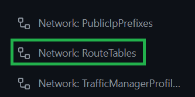
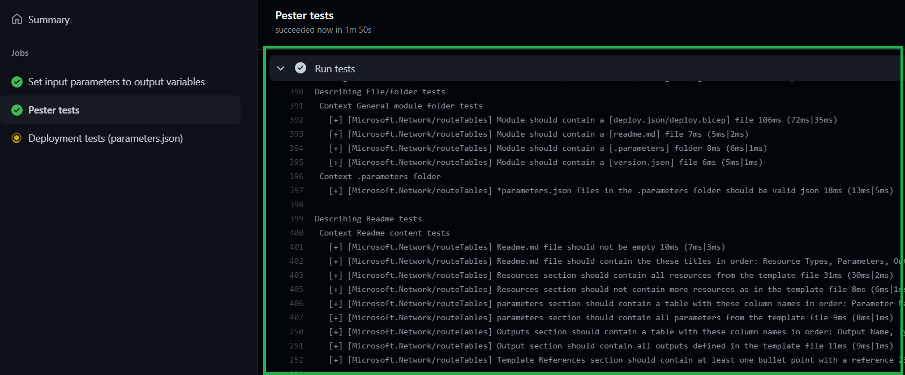
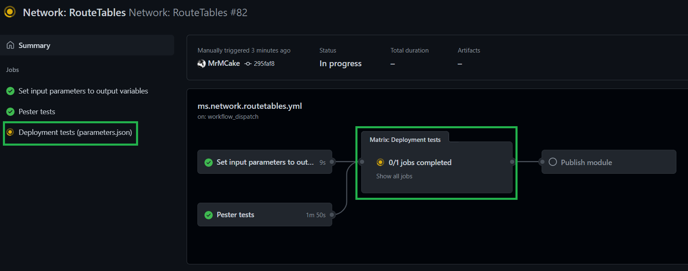
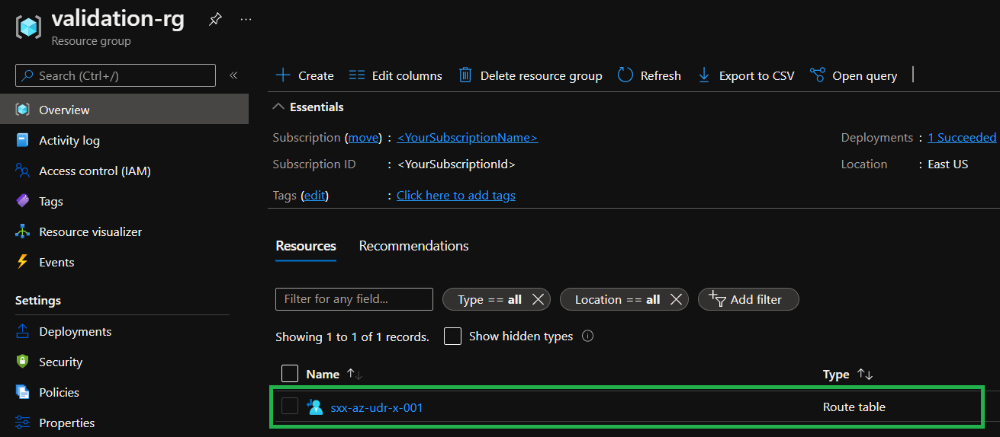
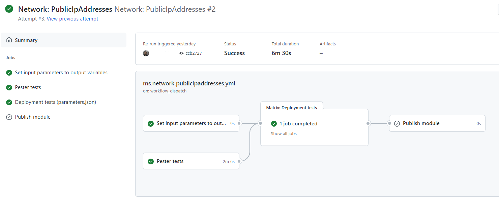
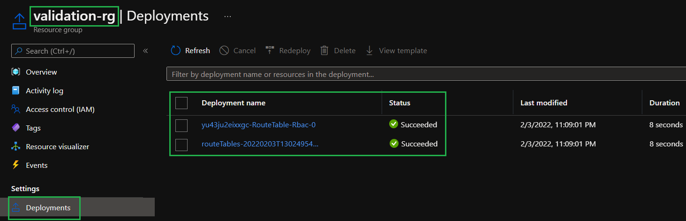

In this LAB you will explore how a module runs through the first two pipeline stages, the local validation, as well as validation through Azure.

### _Navigation_
- [Step 1 - Test the module using the pipeline](#step-1---test-the-module-using-the-pipeline)
- [Step 2 - Check up on the deployment](#step-2---check-up-on-the-deployment)
- [Step 3 - Verify the workflow ran correctly](#step-3---verify-the-workflow-concluded-correctly)

---

# Step 1 - Test the module using the pipeline

After this preparation phase, we're sure you would like to see some Action(s)!

1. Click on `Actions`

    

1. Look for the `Network: RouteTables` workflow

    

1. Select the `Run workflow` button. Make sure the selected branch is the one you created in Lab 2 and click on `Run workflow` on the bottom.

    

# Step 2 - Check up on the deployment

1. Once the pipeline is triggered you will notice that the `Pester tests` job starts executing. 

    

1. If you click on the `Pester tests` job, GitHub opens the log of the selected job and you can see the tests that it is running

    

1. Once the `Pester tests` job concluded successfully, the `Deployment tests` job will start and test the parameter file referenced by the pipeline job (`parameters.json`). In sequence, the job executes 3 fundamental tasks
- Run a static Test-Az*Deployment using both the module's `deploy.json` and the aforementioned parameter file
- Run an actually deployment against the Azure environment specified through the credentials set up in Lab 2
- Remove set resources once the deployment concluded

    

1. If you click on the `Deployment tests` job, GitHub opens the log of the selected job and you can see the deployment that it is running

    

2. While the deployment is running, you can take a look at the Azure portal. You will notice that a resource group named `validation-rg` has been created, and also, that a route table was created inside it.
   > Note: The pipeline operates fairly quickly, so it can happen that the route table was already removed by the time you open the resource group
      
    

# Step 3 - Verify the workflow concluded correctly

Let's now see what happened.

1. First of all, if you click on the run, you should see jobs have run successfully.

    

    > You will also notice the `Publish module` step has been skipped. This is because the workflows will only execute this job if run from the `main` branch, so that you do your test before the publishing happens.

2. You can also examine the deployment in the Azure portal by navigating to the resource group `validation-rg`, select `Deployments` in its blade and check the list of deployments opening to the right. If you select any one of them you can see the used inputs, template & outputs - and even drill down into nested deployments.

    

    > You will notice the resource group has no resources now. By default, the last step of the deployment will also remove what has been deployed, to keep the testing sandbox subscription cost as low as possible.
    >
    > You can modify this behaviour by unflagging `Remove deployed module` flag when running a workflow

---

If ready, proceed to the next lab: [Lab 5 - Extend test coverage](./Lab%205%20-%20Extend%20test%20coverage)
