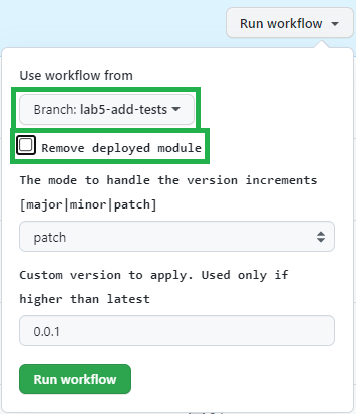

In this LAB you will _enhance_ an existing module by adding additional tests.

For this LAB, we will use another simple and quick to deploy module: `availabilitySets`.

# Step 1 - Examine the module
   
1. In your VSCode, navigate to the path `arm/Microsoft.Compute/availabilitySets`. You will notice the `readme.md` file describes several parameters and only one of them, `name`, is marked as _`Required`_.

    

1. Next, navigate to `.parameters/parameters.json` of the same module. This file is used for testing the module. It specifies only the `name` and `roleAssignments` parameters. In this lab you will:
    - update the existing `parameters.json` file to test an additional parameter
    - add one additional parameter file to test the minimum set of parameters 

# Step 3 - Update existing parameter file

# Step 4 - Add a new parameters file

You will now create a parameter file that will test all the availabilitySets module parameters.

1. On your code editor go to the `arm/Microsoft.Compute/availabilitySets/.parameters` folder
1. Create a new file and name it `full.parameters.json`
1. Edit the new file adding a value for all the parameters. If you need help to fill all the parameters, see the [sample below](#Full-parameter-file)

# Step 5 - Add the new file to the workflow 

Now you have to modify the workflow file to make sure it also uses the new parameter file during the tests.

1. On your code editor open the `.github/workflows/ms.compute.availabilitysets.yml` file.
1. Go to line 94. You should see the parameters matrix where you will need to add `full.parameters.json`

    

# Step 6 - Test the deployment

You will now manually test the deployment, verifying it's using both the parameter files.

1. On GitHub, go to Action
1. Find the `Compute: AvailabilitySets` workflow
1. Manually run the workflow, _making sure your branch_ is selected. You can unflag the `Remove deployed module`

    

1. You can click on the running workflow and verify that you have a separate job for each specified parameter file.

    

1. When the jobs complete, you will be able to see both the availability sets has been deployed. You can also verify the settings corresponds to the ones specified in the corresponding parameter file.

    

# Full parameter file

```json
{
    "$schema": "https://schema.management.azure.com/schemas/2019-04-01/deploymentParameters.json#",
    "contentVersion": "1.0.0.0",
    "parameters": {
        "name": {
            "value": "sxx-az-avs-x-002"
        },
        "cuaId": {
            "value": "7ee5499f-1f22-42bd-8f01-ffee4ce55d56"
        },
        "location": {
            "value": "westeurope"
        },
        "lock": {
            "value": "NotSpecified"
        },
        "availabilitySetFaultDomain": {
            "value": 3
        },
        "availabilitySetUpdateDomain": {
            "value": 4
        },
        "availabilitySetSku": {
            "value": "Classic"
        },
        "proximityPlacementGroupId": {
            "value": "/subscriptions/<<subscriptionId>>/resourceGroups/dependencies-rg/providers/Microsoft.Compute/proximityPlacementGroups/dependency-ppg"
        }
    }
}
```

# Appendix

## Proximity Placement Group dependency

In case the dependency pipeline of [Lab 3](./Lab 3 - Deploy Dependencies) failed to deploy the required Proximity placement group for any reason, you can use the below instructions to create it manually in via the Azure Portal.

1. Navigate to the azure portal and search for proximity placement groups

    

1. Next, select the `+ Create` button in the Proximity placement groups view

    

1. Select the `validation-rg` resource group, a `location` and a `name` for the resource (e.g. `adp-<<YourNamePrefix>>-az-ppg-x-001`) and create the resource

   > ***Note:*** The name you give the resource must exactly match the one specified in the availability set's parameter file (excluding the token).

    
