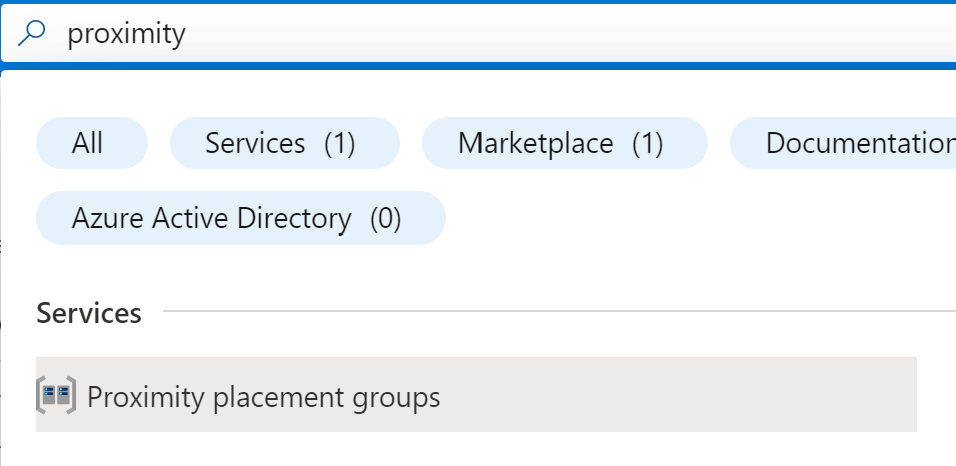
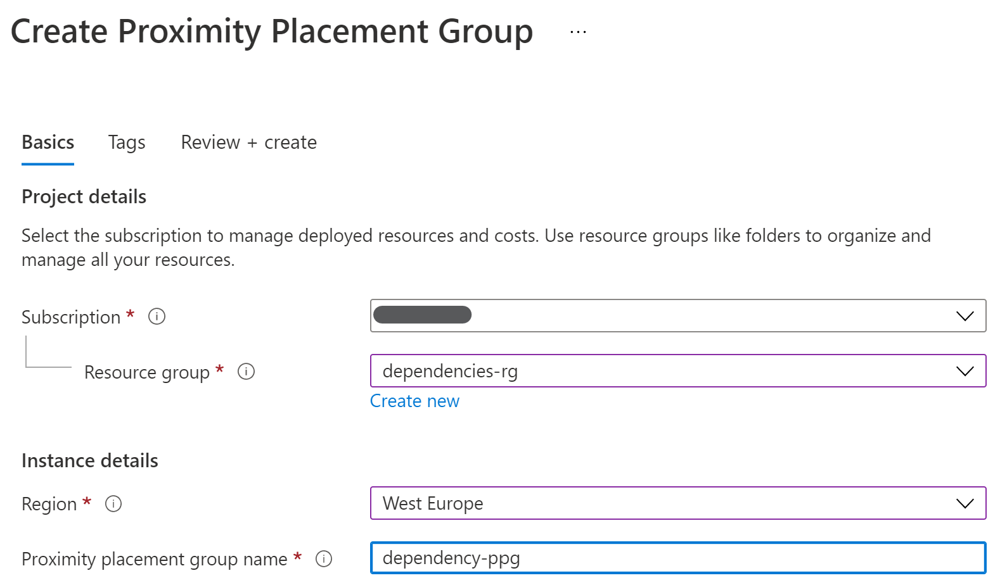
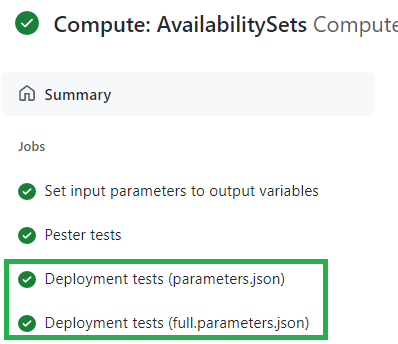
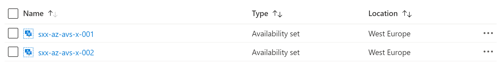

In this LAB you will _enhance_ an existing module by adding additional tests.

For this LAB, we will use another simple and quick to deploy module: `availabilitySets`.

# Step 1 - Create a new branch

1. As said before, you should avoid working on the `main` branch directly. Make sure you're located on your fork of _CARML_ and create a new branch. For consistency, name it `lab5-add-tests`.
1. Navigate to the `arm/Microsoft.Compute/availabilitySets`. You will notice the `readme.md` file describes several parameters and only one of them (`name`) is _Required_.
1. Navigate to `.parameters/parameters.json` (from `arm/Microsoft.Compute/availabilitySets`). This is the file used for testing the module. This specifies only the `name` and `roleAssignments` parameters.
1. You now want to test specifying all the available parameters.

# Step 2 - Create dependency: proximityPlacementGroup

In the `proximityPlacementGroupId` parameter you will need to provide a value for a proximity placement group resource. In this step you'll create it manually from the azure portal.

> As it's needed for testing a module, the proximity placement group should be created by the dependency pipeline. This is currently not implemented.

1. Navigate to the azure portal and search for proximity placement groups

    

1. Select `dependencies-rg` resource group, a location and a name for the resource (e.g. `dependency-ppg`), than create the resource

    

# Step 3 - Add a new parameters file

You will now create a parameter file that will test all the availabilitySets module parameters.

1. On your code editor go to the `arm/Microsoft.Compute/availabilitySets/.parameters` folder
1. Create a new file and name it `full.parameters.json`
1. Edit the new file adding a value for all the parameters. If you need help to fill all the parameters, see the [sample below](#Full-parameter-file)

# Step 4 - Configure workflow to use the new file

Now you have to modify the workflow file to make sure it also uses the new parameter file during the tests.

1. On your code editor open the `.github/workflows/ms.compute.availabilitysets.yml` file.
1. Go to line 94. You should see the parameters matrix where you will need to add `full.parameters.json`

    

# Step 5 - Test the deployment

You will now manually test the deployment, verifying it's using both the parameter files.

1. On GitHub, go to Action
1. Find the `Compute: AvailabilitySets` workflow
1. Manually run the workflow, _making sure your branch_ is selected. You can unflag the `Remove deployed module`

    

1. You can click on the running workflow and verify that you have a separate job for each specified parameter file.

    

1. When the jobs complete, you will be able to see both the availability sets has been deployed. You can also verify the settings corresponds to the ones specified in the corresponding parameter file.

    

# Full parameter file

```json
{
    "$schema": "https://schema.management.azure.com/schemas/2019-04-01/deploymentParameters.json#",
    "contentVersion": "1.0.0.0",
    "parameters": {
        "name": {
            "value": "sxx-az-avs-x-002"
        },
        "cuaId": {
            "value": "7ee5499f-1f22-42bd-8f01-ffee4ce55d56"
        },
        "location": {
            "value": "westeurope"
        },
        "lock": {
            "value": "NotSpecified"
        },
        "availabilitySetFaultDomain": {
            "value": 3
        },
        "availabilitySetUpdateDomain": {
            "value": 4
        },
        "availabilitySetSku": {
            "value": "Classic"
        },
        "proximityPlacementGroupId": {
            "value": "/subscriptions/<<subscriptionId>>/resourceGroups/dependencies-rg/providers/Microsoft.Compute/proximityPlacementGroups/dependency-ppg"
        }
    }
}
```

---

[Now proceed to the next LAB](./Lab%206%20-%20Publishing)
