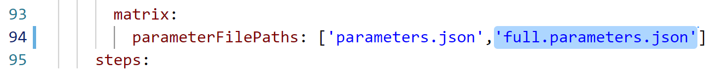
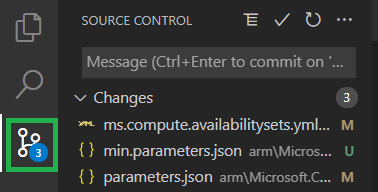
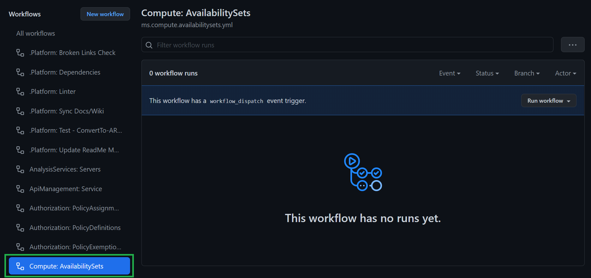
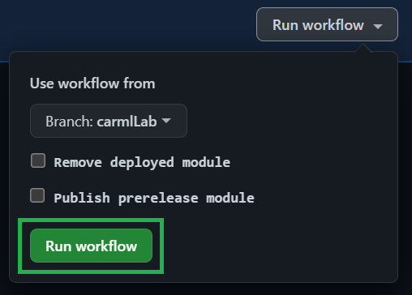
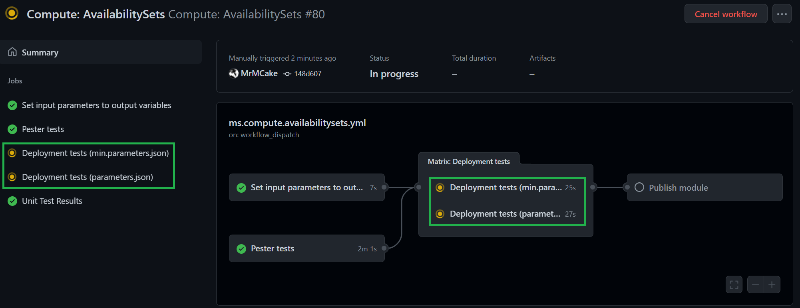
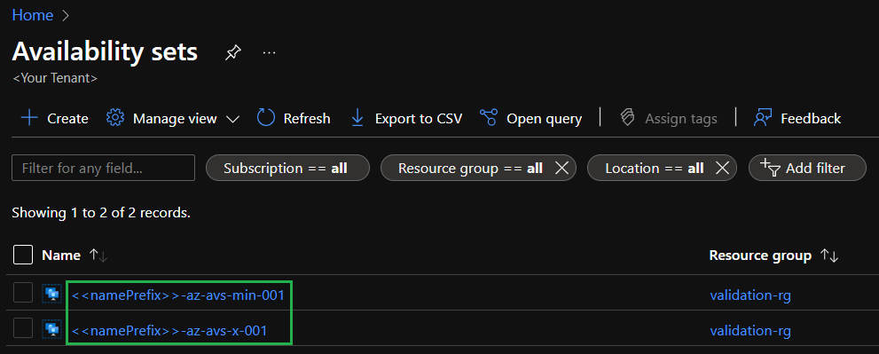
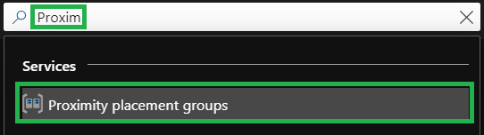
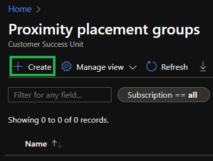
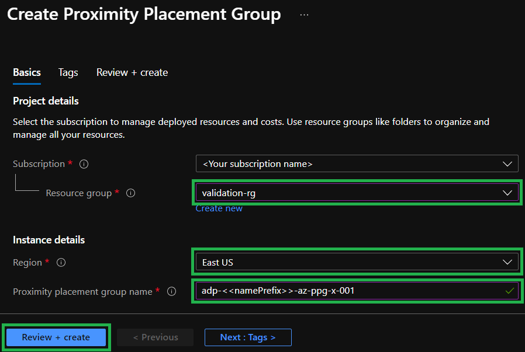

In this LAB you will _enhance_ an existing module by adding additional tests.

For this LAB, we will use another simple and quick to deploy module: `availabilitySets`.

### _Navigation_
- [Step 1 - Examine the module](#step-1---examine-the-module)
- [Step 2 - Update existing parameter file](#step-2---update-existing-parameter-file)
- [Step 3 - Add a new parameters file](#step-3---add-a-new-parameters-file)
- [Step 4 - Add the new file to the workflow](#step-4---add-the-new-file-to-the-workflow)
- [Step 5 - Upload your changes to GitHub](#step-5---upload-your-changes-to-github)
- [Step 6 - Test the deployment](#step-6---test-the-deployment)
- [Optional Appendix](#optional-appendix)

---


# Step 1 - Examine the module
   
1. In your VSCode, navigate to the path `arm/Microsoft.Compute/availabilitySets`. You will notice the `readme.md` file describes several parameters and only one of them, `name`, is marked as _`Required`_.

    

1. Next, navigate to `.parameters/parameters.json` of the same module. This file is currently used to 'deployment'-test the module. It specifies only the `name` and `roleAssignments` parameters. In this lab you will:
    - update the existing `parameters.json` file to test an additional parameter
    - add one additional parameter file to test the minimum set of parameters 

# Step 2 - Update existing parameter file

At this point, the dependency pipeline of [Lab 3](./Lab%203%20-%20Deploy%20Dependencies) should have deployed a `Proximity Placement Group` for you. In case the pipeline failed for any reason you can create the dependency manually by following the steps described [here](#proximity-placement-group-dependency). Once the dependency is available, proceed with the follow steps:

1. If not already open, navigate back to the `parameter.json` file in path `arm\Microsoft.Compute\proximityPlacementGroups\.parameters\parameters.json` in your local VSCode instance.

1. Next, add the below snipped as a new parameter to the parameter file and ensure the name of the proximity placement group matches the one you deployed as a dependency. Values such as the `subscriptionID` & `namePrefix` will automatically be replaced by the pipeline

    ```Json
    "proximityPlacementGroupId": {
        "value": "/subscriptions/<<subscriptionId>>/resourceGroups/validation-rg/providers/Microsoft.Compute/proximityPlacementGroups/adp-<<namePrefix>>-az-ppg-x-001"
    }
    ```

1. By adding the new parameter, the deployment in the pipeline will pick it up and validate that the template uses it successfully and as intended. The full parameter file should look like

    ```Json
    {
        "$schema": "https://schema.management.azure.com/schemas/2019-04-01/deploymentParameters.json#",
        "contentVersion": "1.0.0.0",
        "parameters": {
            "name": {
                "value": "<<namePrefix>>-az-avs-x-001"
            },
            "roleAssignments": {
                "value": [
                    {
                        "roleDefinitionIdOrName": "Reader",
                        "principalIds": [
                            "<<deploymentSpId>>"
                        ]
                    }
                ]
            },
            "proximityPlacementGroupId": {
                "value": "/subscriptions/<<subscriptionId>>/resourceGroups/validation-rg/providers/Microsoft.Compute/proximityPlacementGroups/adp-<<namePrefix>>-az-ppg-x-001"
            }
        }
    }
    ```

# Step 3 - Add a new parameters file

Next you will create a new parameter file that will test that the template's default values work as intended by providing only the minimum set of parameters.

1. If not already, navigate again to the `arm/Microsoft.Compute/availabilitySets/.parameters` folder

1. Create a new file and name it `min.parameters.json`

1. As you examined earlier, the template requires only requires you to provide the `name` parameter. To this end, add the follow content to the created parameter file:

    ```json
    {
        "$schema": "https://schema.management.azure.com/schemas/2019-04-01/deploymentParameters.json#",
        "contentVersion": "1.0.0.0",
        "parameters": {
            "name": {
                "value": "<<namePrefix>>-az-avs-min-001"
            }
        }
    }
    ```

    > ***Note:*** The name value is different from the previous `parameters.json` file. As both resources are deployed in parallel, they must have different names to not interfere with one another.

# Step 4 - Add the new file to the workflow 

Now you have to modify the workflow file to make sure it also uses the new parameter file during the tests.

1. Navigate to the path `.github/workflows/ms.compute.availabilitysets.yml`.
   
1. In line 84 you should see the parameters `matrix` where you will need to add the `min.parameters.json`

    

    > ***Note:*** If this would be a direct contribution to the main CARML repository, we'd also ask you to update the corresponding Azure DevOps template file in the similar way

# Step 5 - Upload your changes to GitHub

Now that the tests are implemented and the pipeline updated, you can upload your changes to GitHub.

1. This can either be done via the terminal or by using the Git integration of VSCode. To keep it simple, this lab assumes you want to use the VSCode's git integration. If not already there, navigate to the source control menu to the left.

    

1. Here you first need to add the changed files to the commit. To do so, select the `+` icon next to `Changes` (appears when hovering)

    

1. Next, you should give the commit a meaningful message such as 'Added new minimum parameter test file and proximity placement group test to availability set module' and can then click the checkmark symbol on the top to create the commit

    

1. Finally, you can push the changes to the repository by selecting the blue `Publish Branch` button

    


# Step 6 - Test the deployment

You will now manually test the deployment, verifying it's template using both parameter files.

1. On GitHub, go to Actions

    

1. Find the `Compute: AvailabilitySets` workflow

    

1. Further select your branch from the `Branch:` dropdown (e.g. `carmlLab`)

    

1. Unflag the `Remove deployed module` and execute the workflow

    

1. You can click on the running workflow and verify that you have a separate job for each specified parameter file.

    

2. Once the jobs are completed, you can see that both availability groups have been deployed to Azure. You can also verify the settings correspond to the ones specified in the corresponding parameter file.

    

---

[Now proceed to the next LAB](./Lab%206%20-%20Publishing)

# Optional Appendix

## Proximity Placement Group dependency

In case the dependency pipeline of [Lab 3](./Lab%203%20-%20Deploy%20Dependencies) failed to deploy the required Proximity placement group for any reason, you can use the below instructions to create it manually in via the Azure Port

1. Navigate to the azure portal and search for proximity placement groups

    

1. Next, select the `+ Create` button in the Proximity placement groups view

    

1. Select the `validation-rg` resource group, a `location` and a `name` for the resource (e.g. `adp-<<YourNamePrefix>>-az-ppg-x-001`) and create the resource

   > ***Note:*** The name you give the resource must exactly match the one specified in the availability set's parameter file (excluding the token).

    
