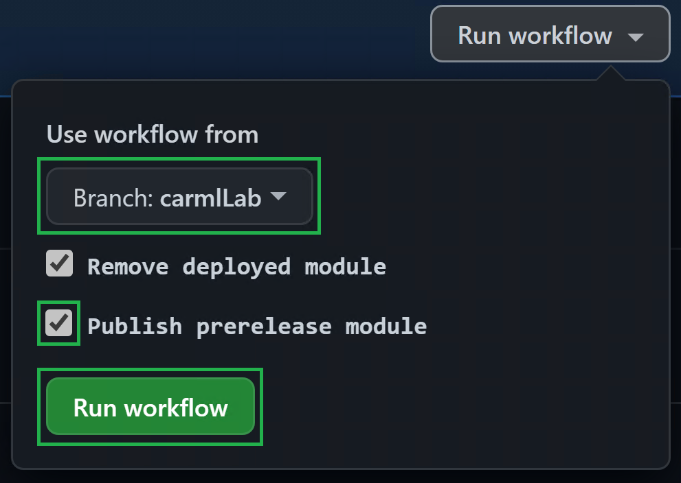
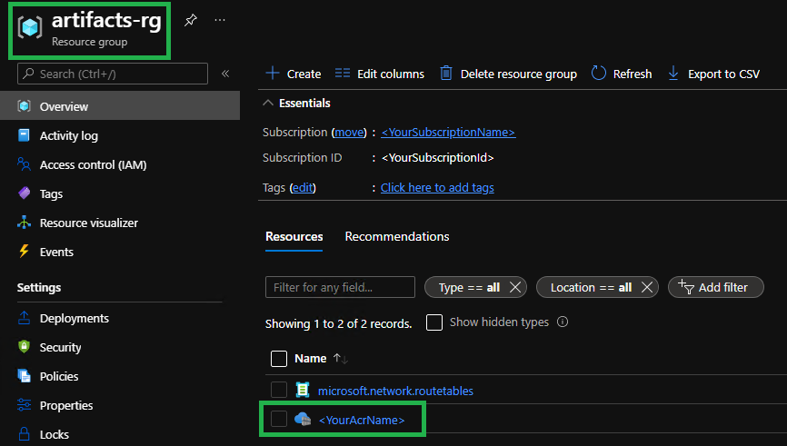
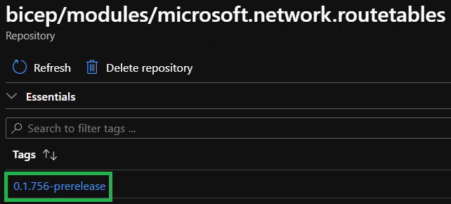
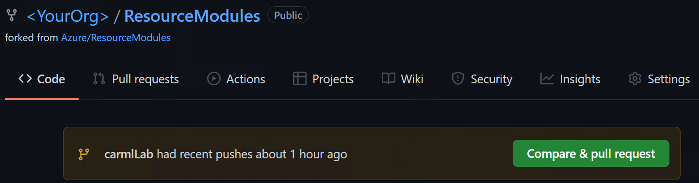
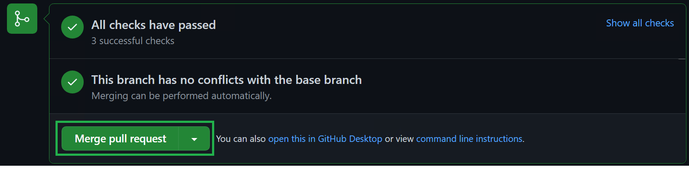
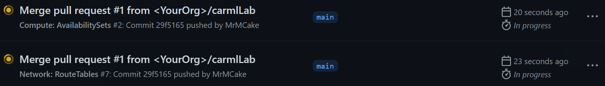
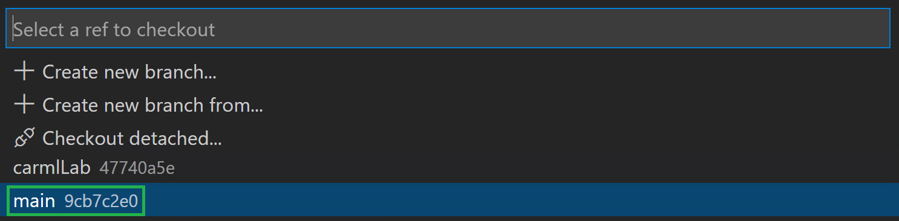
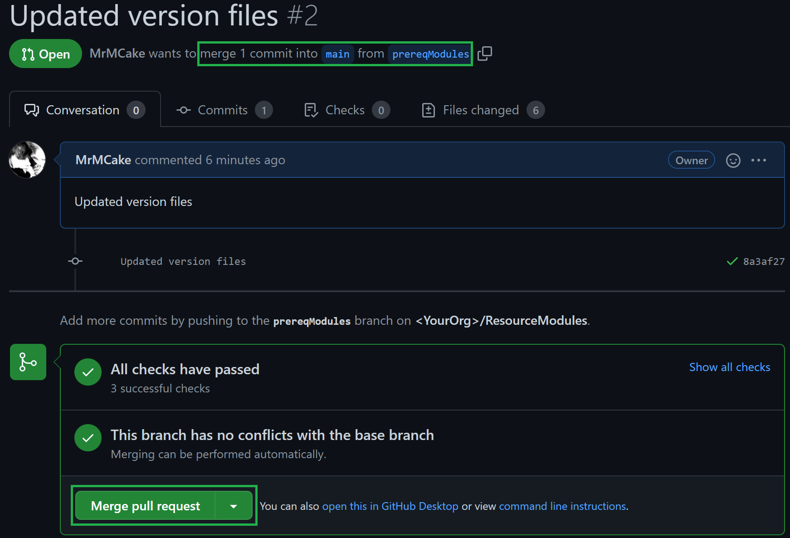

In this lab, you will learn how to publish modules, both for releases and prereleases. You will also publish your first modules to the Bicep Registry.

### _Navigation_
- [Step 1 - Publish prerelease for a module](#step-1---publish-prerelease-for-a-module)
- [Step 2 - Run the workflow in GitHub](#step-2---run-the-workflow-in-github)
- [Step 3 - Verify the published module](#step-3---verify-the-published-module)
- [Step 4 - Prepare to publish a release](#step-4---prepare-to-publish-a-release)
- [Step 5 - Prepare to publish a release](#step-5---prepare-the-next-lab)
---

# Step 1 - Publish prerelease for a module

1. In your local VSCode, find the file `arm\Microsoft.Network\routeTables\version.json` and update the version property to be `0.1`.

    

1. Next, upload your changes in the same manner as you did before, add your changes to the commit, create a commit with a corresponding commit message (e.g. `Updated route table version to 0.1`) and push the changes to GitHub

    

# Step 2 - Run the workflow in GitHub

1.  Find the workflow for `Network: RouteTables` in the `Actions` tab in GitHub.

1.  Click on the "Run workflow" button, select branch `dev/routeTable` and check the box for `Publish prerelease`.

    

1. Wait for the workflow to run, verify that the workflow has published a prerelease version (`0.1.x-prerelease`) to the Bicep registry.

    

# Step 3 - Verify the published module

One of the ways you can verify whether the publishing worked is by going to the Azure portal and investigating the bicep registry. 

1. To get there, you first have to navigate to the resource group containing the container registry (by default `artifacts-rg`). In it, search for the ACR that you specified in [Lab 2](./Lab%202%20-%20Setup%20CARML%20prerequisites#Set-the-container-registry-unique-name).

       

1. Next, find the `bicep/modules/microsoft.network.routetables` repository. 
    
    

1. Check the repository for the published version.

    

# Step 4 - Prepare to publish a release

Next, you will create an actual release, that is, publish modules without the prerelease flag. To do so, proceed with the following steps: 

1. First, you need to create a pull request. As `carmlLab` was the last branch you worked on, GitHub should create a banner with a button `Compare & Pull request` for you, once you navigate to the `<> Code` tab (refresh the page if it does not show up automatically).

   

1. In the PR, first you have to make sure the correct target location is selected. By default the PR would be opened to the upstream CARML repository. To do so, just select your fork from the left dropdown. The UI will then automatically adjust the target to `main`.

   
 
2. provide a meaningful description and if you're interested also check the file changes (should be around 6 files) to make sure everything seems in order. Once you're ready, go ahead an merge the pull request.

   

3. Check the workflow run that was triggered by the merge (push) to main 

   

    > **Note:** The pipelines will roughly take ***10 minutes*** to complete. However, you can already proceed with the next steps.

4. If you further drill into the route table pipeline run, open its `Publish module` logs, and you can get a detailed view of its process to determine the new version to publish into the target location

    

# Step 5 - Prepare the next lab

For the next lab you will need a few more modules being published. To do so, proceed with the following steps:

1. Back in VSCode, change the branch to `main` and fetch the latest changes. You can achieve this in two ways:

      - **Alternative 1:** Via VSCode's terminal by executing the following commands
      
        ```PowerShell
          git checkout 'main'
          git pull
        ```

     - **Alternative 2:** You can perform a few steps in the UI

       1. Initiate the branch change by selecting the current branch on the bottom left of the VSCode window

             

        1. Next, a dropdown opens where you select the `main` branch

             

        1. Finally, you only have to trigger the `Sychronize` symbol on the bottom left next to the active branch

             

1. Create a new branch `prereqModules`. Again you can do this in two ways:

   - **Alternative 1:** Via VSCode's terminal with the following steps
  
      1. If Terminal is not in sight, you can alternatively open it by expanding the `Terminal`-dropdown on the top, and selecting `New Terminal`
       
      1. Now, execute the following PowerShell commands:

          ```PowerShell
          git checkout -b 'prereqModules'
          git push --set-upstream 'origin' 'prereqModules'
          ```
   - **Alternative 2:** You can perform a few steps in the UI

      1. Select the current branch on the bottom left of VSCode

           

      1. Select `+ Create new branch` in the opening dropdown

           

      1. Enter the new branch name `prereqModules`

           

      1. Push the new branch to your GitHub fork by selecting `Publish Branch` to the left in the 'Source Control' tab

          

1. Next, change the version number to `0.1` for all of the following modules:
     - `Microsoft.Resources/resourceGroups`
     - `Microsoft.Storage/storageAccounts`
     - `Microsoft.KeyVault/vaults`
     - `Microsoft.OperationalInsights/workspaces`
     - `Microsoft.Insights/components`
     - `Microsoft.MachineLearningServices/workspaces`
    > **Note:** For our purposes it is sufficient to only change the `version.json` file for the top-level resource type. In other words, you can ignore the child-modules.
    >
    > **Note:** Make sure you safe the changes on each file

1. Next, push the changes the same way you did before (either via the UI, or PowerShell). VSCode should display you 6 changed files.

    

1. And as before, create and merge a pull request from the created branch `prereqModules` to your main branch
    > **Note:** Don't forget to select the correct target location (your fork)

    

1. Once the PR is merged, navigate to the `Actions` tab. You should notice 6 pipelines automatically running.

    

    > **Note:** The pipelines will roughly take ***30 minutes*** to complete. However, you can already proceed with the next steps.

> **Background**
>  - When a change in `main` occurs on any of the module files (as configured in the `on:` or `trigger:` sections of the workflow/pipeline file), the workflow runs.
>  - The publishing stage of the workflow will:
>     - Look for changed files in the module and child modules folders.
>     - For a detected change:
>       - Find the nearest template file (`deploy.*` in same folder as the changed file or parent folder).
>       - Find the corresponding `version.json` file and get the `major` and `minor` version numbers. The `patch` number is calculated from 'git height' (number of commits from base commit). If the workflow/pipeline is run on a non `main`/`master` branch, '-prerelease' is added to the version number
>       - Finds all parent module files, and get their version data using the same logic as mentioned before.
>     - Publish each changed child module and parents using the calculated version numbers

---
---

If ready, proceed to the next lab: [Lab 7 - Build an ACR driven solution](./Lab%207%20-%20Contribution)
