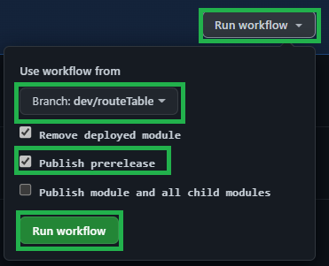
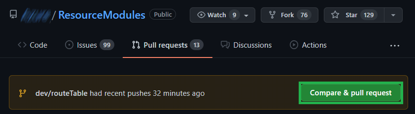
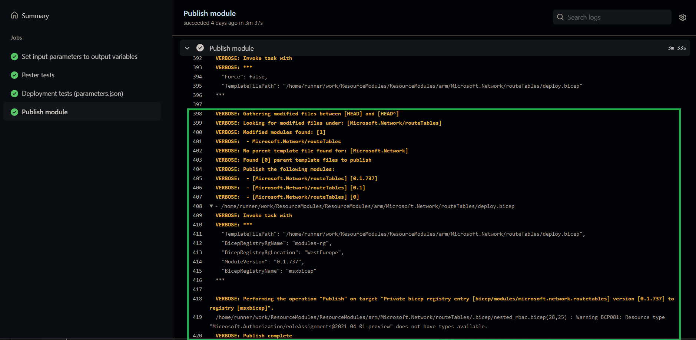

In this lab, you will learn how to publish modules, both for releases and prereleases. You will also publish your first modules to the Bicep Registry.

### _Navigation_
- [Step 1 - Publish prerelease for a module](#step-1---publish-prerelease-for-a-module)
- [Step 2 - Prepare to publish a release](#step-2---prepare-to-publish-a-release)

---

# Step 1 - Publish prerelease for a module

1. Find the file `arm\Microsoft.Network\routeTables\version.json` and update the version property to be `0.1`.

  

1. Next, upload your changes in the same manner as you did before, add your changes to the commit, create a commit with a corresponding commit message (e.g. `Updated route table version to 0.1"`) and push the changes to GitHub

    

# Step 2 Run the workflow in GitHub
  - Find the workflow for `Network: RouteTables`.
  - Click on the "Run workflow" button, select branch `dev/routeTable` and check the box for `Publish prerelease`.

    

  - Wait for the workflow to run, verify that the workflow has published a prerelease version (`x.x.x-prerelease`) to the Bicep registry.

    


  - Verify by going to the Azure portal and investigating the bicep registry. Find the `bicep/modules/microsoft.network.routetables` repository. Check it for published versions.

  

2. Merge your branch with `main` by creating a pull request on GitHub and merging it.

  

1. Check the workflow run that was triggered by the merge (push) to main and see what happends with the published version.

  

# Step 2 - Prepare to publish a release

- Back in VSCode, change to main and sync main branch with the newest changes.

```pwsh
  git checkout main
  git pull
```

- Create and check out a new branch called `dev/prereqModules`.

  ```pwsh
    git checkout -b dev/prereqModules origin/main
  ```

- Now we do the same exercise for all the modules used in Lab 1 and those needed for next lab. Change the version number to `0.1` on the following modules:
  - `Microsoft.Resources/resourceGroups`
  - `Microsoft.Storage/storageAccounts`
  - `Microsoft.KeyVault/vaults`
  - `Microsoft.OperationalInsights/workspaces`
  - `Microsoft.Insights/components`
  - `Microsoft.MachineLearningServices/workspaces`
- Save (`Ctrl+s`), commit and push your changes.

  ```pwsh
    git commit -a -m "update version to 0.1"
    git push origin dev/routeTable
  ```

- Merge your branch with `main` by creating a pull request on GitHub and merging it.
- Go to one of the modules workflows and pay attention to the publish step.

  

  - When a change happends to any of the module files (as configured in the `on:` or `trigger:` sections of the workflow/pipeline file), the workflow runs.
  - The publishing stage of the workflow will:
    - Look for changed files in the module and child modules folders.
    - For a detected change:
      - Find the nearest template file (deploy.* in same folder as the changed file or parent folder).
      - Find the corresponging `version.json` file and get the `major` and `minor` version numbers. The `patch` number is calculated from 'git hight' (number of commits from base commit). If the workflow/pipeline is run on a non `main`/`master` branch, '-prerelease' is added to the version number.
      - Finds all parent module files, and get their version data using the same logic as mentioned over.
    - Publish each changed child module and parents, using the calculated version numbers, publish a `major` and `major.minor` version for easy selection of 'latest' version.
- When you have seen that the workflow has completed for the module you chose, go to the Actions overview and filter the view to show only successful workflow runs.
- Check that the others complete, and verify their published versions in the Azure portal.

Proceed to the next lab: [Lab 7 - Build an ACR driven solution](./Lab%207%20-%20Build%20an%20ACR-driven%20solution.md)
