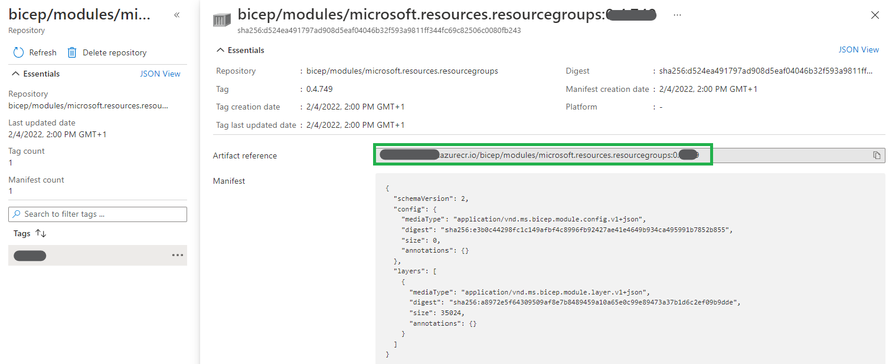

In this lab, you will convert the 

### _Navigation_
- [Step 1 - Modify the workload file to use Bicep Registry](#Step-1---Modify-the-workload-file-to-use-Bicep-Registry)
- [Step 2 - Add new resources](#Step-2---A#dd-new-resources)
- [Step 3 - Add Diagnostic settings and RBAC](#Step-3---Add-Diagnostic-settings-and-RBAC)
---

# Step 1 - Modify the workload file to use Bicep Registry

In the previous lab you published all the neccessary modules to bicep registry. You will now use them to (re-) deploy the workload you deployed in LAB 1.

1. Go to the azure portal and navigate to the `artifacts-rg` resource group
1. Click on the Container registry resource and go to the `Repositories` list
1. Select the first resource type in the list and click on the latest version. You will need to take note of the `Artifact reference` field

    

1. Repeat the previous step for all resources. Make sure you have at least the urls for the following resource types:
    1. Resource group
    1. Storage account
    1. Log Analytics workspace (microsoft.operationalinsights.workspaces)
    1. Application insights (microsoft.insights.components)
    1. Key Vault
    1. Machine Learning service
1. Open the `deploy.bicep` you created in lab 1, in this file you still have the module reference set to the local file
1. Replace the module reference with `br:` + the reference you noted down. E.g. the keyvault first line will look like the following code

    ```bicep
    module kv 'br:youracrname.azurecr.io/bicep/modules/microsoft.keyvault.vaults:0.1.999' = {
    ```

1. Now run the deployment command again. The deployment should succeede (even if no changes will happen)

    ```powershell
    New-AzSubscriptionDeployment @inputObject
    ```

# Step 2 - Add new resources

You will now modify the template to deploy a machine learning service. In this step you will use resources that have dependencies on others, demostrating how easy it is to reference resources created by modules.

1. Machine Learning resource requires a reference to an AppInsights instance. Add the creation of this resource. The code you need to add will be similar to the following:

    ```bicep
    module apin 'br:<<your reference to the app inisights module>>' = {
        scope: resourceGroup(resourceGroupName)
        name: 'workload-apinsights'
        params: {
            appInsightsWorkspaceResourceId: la.outputs.resourceId
            name: 'carml-lab-app-insights'
        }
    }
    ```

    > You will notice we didn't add `dependsOn`. This is not required, as Bicep automatically infer the dependency since you're using another resource property (`la.outputs.resourceId`).

1. You can now add the actual Machine Learning module. The code you need to add will be similar to the following:

    ```bicep
    module ml 'br:<<your reference to the the machine learning module>>' = {
        scope: resourceGroup(resourceGroupName)
        name: 'workload-ml'
        params: {
            associatedApplicationInsightsResourceId: apin.outputs.resourceId
            associatedKeyVaultResourceId: kv.outputs.resourceId
            associatedStorageAccountResourceId: sa.outputs.resourceId
            name: 'carml-lab-ml'
            sku: 'Basic'
            systemAssignedIdentity: true
        }
    }
    ```
## Step 3 - Add Diagnostic settings and RBAC

You can add to the solution new fancy stuff.

1. Add diagnostic settings to resources. Add the following code to the machine learning properties:

    ```bicep
    diagnosticWorkspaceId: la.outputs.resourceId
    diagnosticLogsRetentionInDays: 2
    ```

1. Add Reader role RBAC to one of the resources. You will need an object ID of a principal on your directory. You can use the one of the service principal you're using to deploy, or get the object ID from Azure Active Directory.

    

1. Now add the following lines of code in the properties of a resource (e.g. the storage account):

    ```bicep
    roleAssignments: [
      {
        roleDefinitionIdOrName: 'Reader'
        principalIds: [
          '<an object id of a principal in your directory>'
        ]
      }
    ]
    ```

## Step 4 - Update your workload

You can now re-deploy your template to update and add the new resources.

1. (optional) You didn't add any new parameter to the template, so you can skip this part if your terminal is still open. If you closed the terminal, you can set up the input variable as you did in Lab1

    ```Powershell
    $inputObject = @{
        DeploymentName     = "CARML-workload-$(-join (Get-Date -Format 'yyyyMMddTHHMMssffffZ')[0..63])"
        TemplateFile       = '<FullPathToYourTemplateFile>' # Get the path via a right-click on the template file in VSCode & select 'Copy Path'
        Location           = '<LocationOfYourChoice>' # E.g. WestEurope
        Verbose            = $true
        ResourceGroupName  = '<NameOfTheResourceGroup>' # E.g. workload-rg
        StorageAccountName = '<NameOfTheStorageAccount>' # Must be globally unique
        KeyVaultName       = '<NameOfTheKeyVault>' # Must be globally unique
        LogAnalyticsName   = '<NameOfTheLogAnalyticsWorkspace>' # E.g. carml-law
    }
    ```

1. Now execute again the deployment

    ```Powershell
    New-AzSubscriptionDeployment @inputObject
    ```

1. At last, you can check in the Azure portal if the template deployed what you expected to.

---

[Now proceed to the next LAB](./Lab%208%20-%20Interoperability)