In this lab, you will learn how a contribution to the source repository (in this example the CARML main repository) would look like. At a customer, the same approach could be used to allow teams to contribute to a central library.

### _Navigation_
- [Step 1 - Create a contribution branch](#step-1---create-a-contribution-branch)
- [Step 2 - Implement the contribution](#step-2---implement-the-contribution)
- [Step 3 - Run local test(s)](#step-3---run-local-tests)
- [Step 4 - Re-generate the documentation](#step-4---re-generate-the-documentation)
- [Step 5 - Re-run local test(s)](#step-5---re-run-local-tests)
- [Step 6 - Upload your changes and run the module pipeline](#step-6---upload-your-changes-and-run-the-module-pipeline)
- [Step 7 - Create a Pull Request](#step-7---create-a-pull-request)
- [Step 8 - Exclude environment-specific changes](#step-8---exclude-environment-specific-changes)

---

# Step 1 - Create a contribution branch

For the subsequent contribution, you first need a new branch. Similar to the other labs, create one by performing the following sequence of steps:

1. In VSCode, change the branch to `main` and fetch the latest changes. You can achieve this in two ways:

    <details>
    <summary><b>Alternative 1: Via VSCode's terminal</b></summary>

    1. If Terminal is not in sight, you can alternatively open it by expanding the Terminal-dropdown on the top, and selecting New Terminal

    1. Executing the following commands

        ```PowerShell
            git checkout 'main'
            git pull
        ```
    </details>

    <details>
    <summary><b>Alternative 2: Via VSCode's UI</b></summary>

    1. Initiate the branch change by selecting the current branch on the bottom left of the VSCode window

        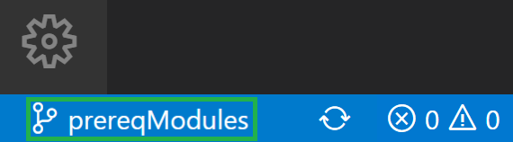

    1. Next, a dropdown opens where you select the `main` branch

        

    1. Finally, you only have to trigger the `Sychronize` symbol on the bottom left next to the active branch

        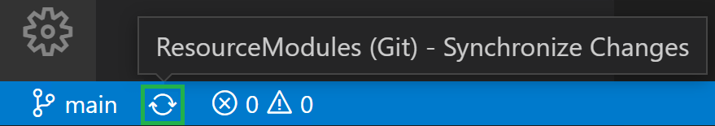

    </details>

<p>

1. Next, create a new branch `contribution`. You can achieve this in two ways:

    <details>
    <summary><b>Alternative 1: Via VSCode's terminal</b></summary>

    1. If a Terminal is not in sight, you can alternatively open it by expanding the `Terminal`-dropdown on the top, and selecting `New Terminal`

    1. Now, execute the following PowerShell commands:

        ```PowerShell
        git checkout -b 'contribution'
        git push --set-upstream 'origin' 'contribution'
        ```
    </details>

    <details>
    <summary><b>Alternative 2: Via VSCode's UI</b></summary>

    1. Select the current branch on the bottom left of VSCode

        

    1. Select `+ Create new branch` in the opening dropdown

        

    1. Enter the new branch name `contribution`


        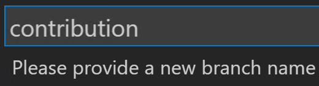

    1. Push the new branch to your GitHub fork by selecting `Publish Branch` to the left in the 'Source Control' tab

        

    </details>

# Step 2 - Implement the contribution

The first step of any contribution is its implementation. For the sake if this lab, we will suggest a simple contribution that will allow you the make use of some of our tools:

1. In your local VSCode, navigate via `arm`, on to `Microsoft.Network` and finally to the `routeTable`'s template `deploy.bicep`

    

1. A simple contribution to perform is to define an additional `output`. The Bicep template will return its value upon successful execution. As you will notice in a later lab, these outputs are particularly useful when multiple modules are orchestrated together. Please add the following snippet to the end of the file:

    ```Bicep
    @description('The routes of the deployed route table')
    output route array = routeTable.properties.routes
    ```

1. As adding an output is a feature update, we also have to update the `version.json` file, incrementing the minor version number by 1.

# Step 3 - Run local test(s)

CARML comes with a number of tools that you can use to perform several automated tasks for you. One of these tools can be use to perform the same tests locally as you would see in the pipeline. To do so, please perform the following tasks:

1. Navigate navigate through the folders `utilities` and `tools` and click on the script `Test-ModuleLocally.ps1`.

    

1. Next, you must load the function implemented in the script by triggering the `Run` button to the top right of VSCode.

    

    > ***Note***: Should VSCode ask you (in the terminal) whether you are sure you want to execute the script, please confirm
    > 

1. Once confirmed, the function will be loaded and can be invoked via the command of the same name `Test-ModuleLocally`. As stated earlier, the script replicates the feeling of the pipeline. That means, it can run a simple Pester test, but also a deployment which includes a parameter file using tokens. For our purpose, please invoke the function as follows

    ```PowerShell
    $TestModuleLocallyInput = @{
        templateFilePath           = '<PathToTheUpdatedTemplate>' # Get the path via a right-click on the updated template file in VSCode & select 'Copy Path'
        PesterTest                 = $true
    }
    Test-ModuleLocally @TestModuleLocallyInput -Verbose
    ```

1. Confirm to execute the script. After a moment, the terminal will show the test cases that are executed and should show one failed test

    

    So why did it fail? Well, as per its description: The ReadMe outputs section should document all outputs defined in the template file. Before, you added a new template output, but the readme remained in its original state.

# Step 4 - Re-generate the documentation

To update the readme, we provide another utility called `Set-ModuleReadMe`. This script again takes the template file path as an input an creates / updates almost all content of the module's readme file for you.

1. To get started you need to load the function first. Like before, load the script in path `utilities\tools\Set-ModuleReadMe.ps1`.

    

2. Next, you can invoke the function as follows

    ```PowerShell
    Set-ModuleReadMe -TemplateFilePath '<PathToTheUpdatedTemplate>' # Get the path via a right-click on the updated template file in VSCode & select 'Copy Path'
    ```

3. Once you confirmed the execution of the script you should notice that the module's `readme.md` file is marked as modified.

    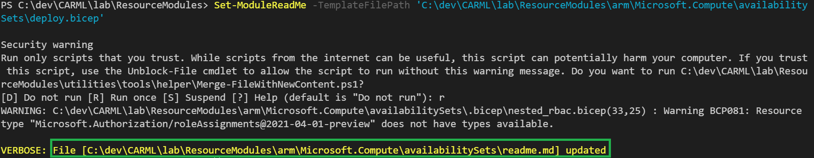

4. If you open version control to the left you should notice at least the template file `deploy.bicep` and readme file `readme.md` to be marked as changed. If you click on the readme specifically, a comparison view will open and show you that the readme was correctly updated

    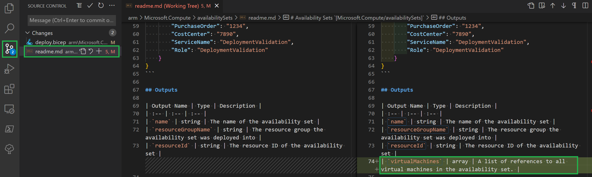

# Step 5 - Re-Run local test(s)

With the readme updated we can now re-run the test to confirm everything is in order.

1. Select again the terminal and either use your arrow-up key go through your previous commands until the get to the one that triggered the test (`Test-ModuleLocally`), or copy the same snipped from [Step 2](#step-2---run-local-tests).

    ```PowerShell
    $TestModuleLocallyInput = @{
        templateFilePath           = '<PathToTheUpdatedTemplate>' # Get the path via a right-click on the updated template file in VSCode & select 'Copy Path'
        PesterTest                 = $true
    }
    Test-ModuleLocally @TestModuleLocallyInput -Verbose
    ```

1. This time, however, none of the tests should fail:

    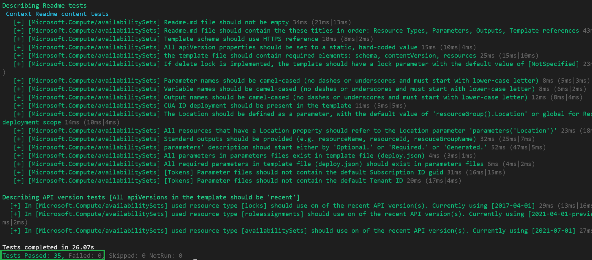

# Step 6 - Upload your changes and run the module pipeline

Now that the contribution is implemented and the tests are green, you can continue to prepare everything for the subsequent pull request.

1. The first thing you have to do is to upload your changes. You can do this either via the terminal or by using the Git integration of VSCode:

    <details>
    <summary><b>Alternative 1: Via VSCode's terminal</b></summary>

    1. If a Terminal is not in sight, you can alternatively open it by expanding the `Terminal`-dropdown on the top, and selecting `New Terminal`

    1. Now, execute the following PowerShell commands:

        ```PowerShell
        git add .
        git commit -m 'Added output to route table'
        git push
        ```

    </details>

    <details>
    <summary><b>Alternative 2: Via VSCode's UI</b></summary>

    1. Add your changes: If not already there, navigate to the source control menu to the left and add the changed files to the commit. To do so, select the `+` icon next to `Changes` (appears when hovering)

        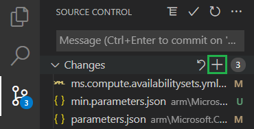

    1. Commit your changes: Next, you should give the commit a meaningful message such as 'Added output to route table' and can then click the checkmark symbol on the top to create the commit

        

    1. Push your changes: Finally, you can push the changes to the repository by selecting the blue `Publish Branch` button

        

    </details>

    <p>

1. Back in your fork, navigate to `Actions`

    

1. From the list of actions to the left, select `Network: RouteTables` followed by the `Run workflow` dropdown to the right

    

1. Further select your branch from the `Branch:` dropdown

    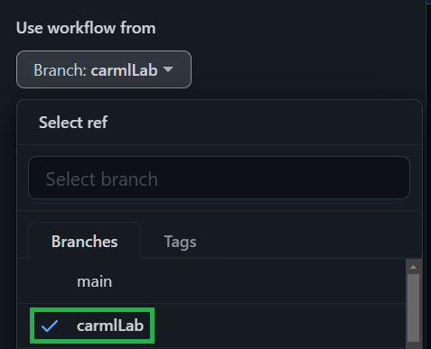

1. And finally trigger the pipeline with the default settings by selecting `Run workflow`

    

    Subsequently, the pipeline will start running through the the same tests you executed locally, but also execute the simulated deployment, followed by an actual test deployment in Azure.

1. While the pipeline is running, we can use the time to create a Pull Request. However, before doing so, you can take the chance to create a pipeline badge that you can attach to the later Pull Request. This badge will show the reviewer that the code changes were successfully validated & tested. To create a badge, first select the three dots (`...`) to the top right of the pipeline, and further the `Create status badge` option.

    

1. In the opening pop up, you first need to select your branch and then click on the `Copy status badge Markdown`

    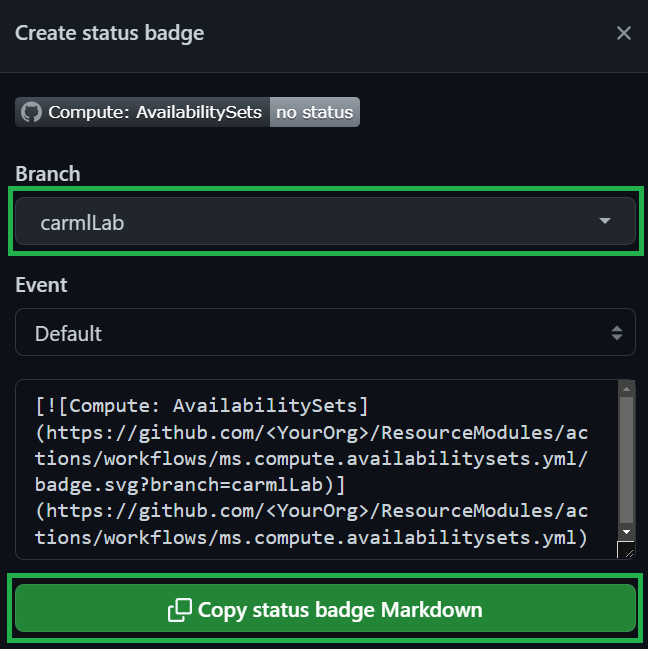

# Step 7 - Create a Pull Request

In this step you will create the pull request. Do do so, perform the following tasks:

1. Navigate to `Pull requests` tab on the top. Here you should have multiple options:
   - As you just uploaded changes to a branch, there is an automated popup that allows you to create a pull request for that branch directly
   - Alternatively, you can create a blank pull request via the `New pull request` button.

   Select now the `New pull request` button.

    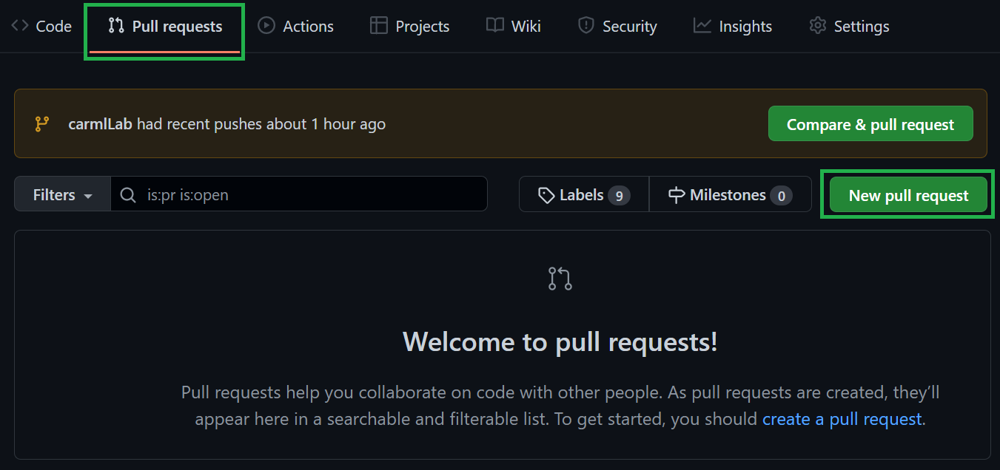

1. This opens a new view in the `Azure/ResourceModules` (target) repository. Here,
    - make you your `branch` is selected on the top right
    - you provide a meaningful `title`
    - you provide a meaningful `description`. This description should include the pipeline badge you copied at the end of from [Step 5](#step-5---upload-your-changes-and-run-the-module-pipeline)
    - select the correct `type of change`. In this case it would be a `New feature`

    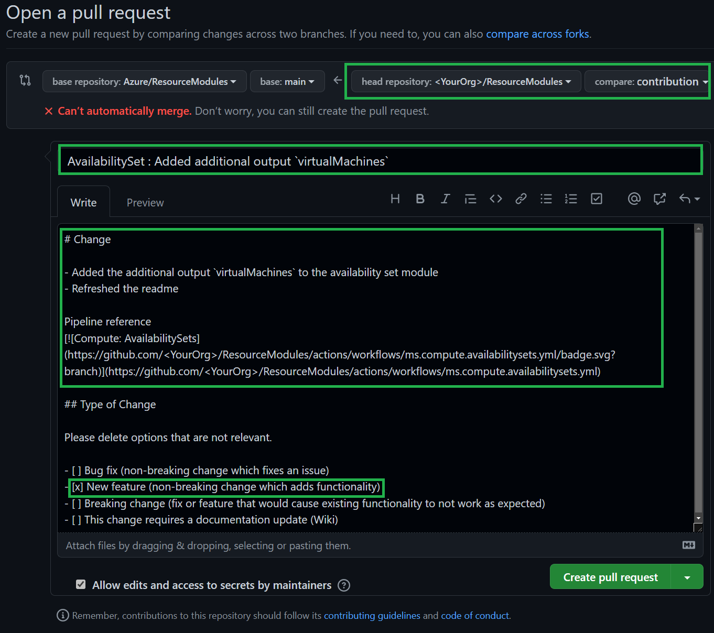

1. Once you entered all the details, you can open a preview of the final look by selecting `Preview` on the top and finally select `Create pull request` to the bottom right.

# Step 8 - Exclude environment-specific changes

Part of your pull request are 2 (or more) files that should not be pushed into the target repository, as they contain details specific to your environment:
- `settings.json`
- `global.variables.json`

To undo these changes you can use any of the following 2 alternatives:

<details>
<summary><b>Alternative 1: Via VSCode's terminal</b></summary>

To reset these files back to original state, run the following command to connect your local repo to the upstream repo and restoring all but the `routeTables` files:

1. Connect to the upstream repo and restore all but the routeTable files from it.

```Powershell
    git remote add upstream https://github.com/Azure/ResourceModules.git
    git restore --source upstream/main * ':!*routeTables*'
```

2. See that the files are restored in "Source Control" in VSCode, and adjust if necessary. I.e. remove any of the "restored" changes you want to bring in.

3. Commit all files and push to your branch. This will update the PR too.

```Powershell
    git commit -a -m 'Reset settings files'
    git push
```

</details>

<details>
<summary><b>Alternative 2: Via VSCode's UI</b></summary>

1. In your Visual Studio Code, open the `settings.json` file in the root directory

  

2. Now, open the `settings.json` of the [`CARML` repository](_https://github.com/Azure/ResourceModules/blob/main/settings.json_), copy its content and overwrite it in your local file in VSCode

  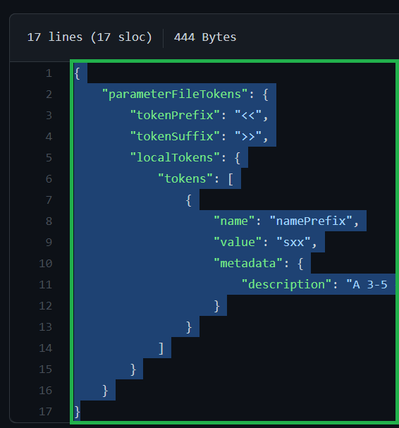

3. Next, perform the same actions for your local `global.variables.json` in path `.github\variables\global.variables.json` and the corresponding file in the [`CARML`](_https://github.com/Azure/ResourceModules/blob/main/.github/variables/global.variables.json_).

4. Once done, perform the same actions of [Step 5](#step-5---upload-your-changes-and-run-the-module-pipeline) to upload your changes to the branch. These changes will automatically be available in the Pull Request you created earlier.

</details>

---
---

If ready, proceed to the next lab: [Lab 8 - Build an ACR driven solution](./Lab%208%20-%20Build%20an%20ACR-driven%20solution)
