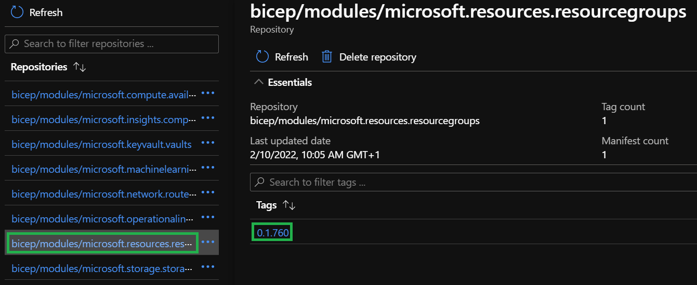
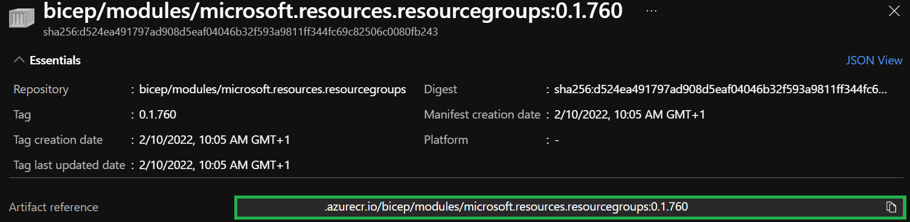
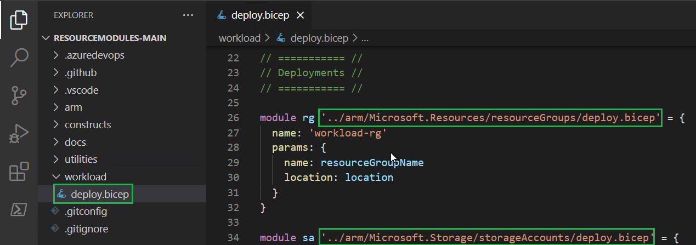
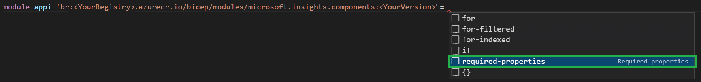
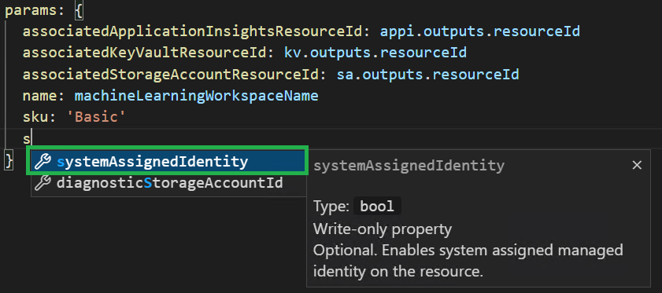

In this lab, you will 
- Update the template you created in Lab 1 to leverage the modules you published to the ACR instead
- Learn how to extend the template with new solutions

### _Navigation_
- [Step 1 - Modify the workload file to use Bicep Registry](#step-1---modify-the-workload-file-to-use-bicep-registry)
- [Step 2 - Add new resources](#step-2---add-new-resources)
- [Step 3 - Add Diagnostic settings and RBAC](#step-3---add-diagnostic-settings-and-rbac)
- [Step 4 - Update your workload](#step-4---update-your-workload)
- [Step 5 - (Optional) Incorporate a bicepconfig.json](#step-5---optional-incorporate-a-bicepconfigjson)
---

# Step 1 - Modify the workload file to use Bicep Registry

In the previous lab you published all the necessary modules to Bicep registry. You will now use them to (re-)deploy the workload you deployed in LAB 1.

1. Go to the Azure portal and navigate to the `artifacts-rg` resource group
1. Navigate to the container registry you specified in [Lab 2](/docs/wiki/Lab%202%20-%20Setup%20CARML%20prerequisites#--set-the-container-registry-unique-name).

   

1. Click on the container registry resource and go to the `Repositories` list

   

1. Select the `bicep/modules/microsoft.resources.resourcegroups` reference and the latest version in the list

   

1. Finally, take note of the `Artifact reference` field

    

1. Repeat the previous step for all of the following resource types:
    | Name | Reference |
    | - | - |
    | Resource group | `bicep/modules/microsoft.resources.resourcegroups`
    | Storage account | `bicep/modules/microsoft.storage.storageaccounts` |
    | Log Analytics workspace | `bicep/modules/microsoft.operationalinsights.workspaces` |
    | Application insights | `bicep/modules/microsoft.insights.components` |
    | Key Vault | `bicep/modules/microsoft.keyvault.vaults` |
    | Machine Learning service | `bicep/modules/microsoft.machinelearningservices.workspaces` |

1. Open the `deploy.bicep` from Lab 1. In this file you still have the module reference set to the local file.

    

1. Replace each module's local reference the sequence:

        `br:` + `<the matching reference you noted down>` 
     
     For example, the resource group's first line will look similar to:

    ```Bicep
    module rg 'br:<YourRegistry>.azurecr.io/bicep/modules/microsoft.resources.resourcegroups:<YourVersion>' = {
    ```

1. Eventually, all references should look similar to:

    ```Bicep
    module rg 'br:<YourRegistry>.azurecr.io/bicep/modules/microsoft.resources.resourcegroups:<YourVersion>' = {}
    module sa 'br:<YourRegistry>.azurecr.io/bicep/modules/microsoft.storage.storageaccounts:<YourVersion>' = {}
    module kv 'br:<YourRegistry>.azurecr.io/bicep/modules/microsoft.keyvault.vaults:<YourVersion>' = {}
    module la 'br:<YourRegistry>.azurecr.io/bicep/modules/microsoft.operationalinsights.workspaces:<YourVersion>' = {}
    ```

2. Now, re-run the template's deployment like you did in  [Lab 1](./Lab%201%20-%20Use%20CARML%20to%20deploy%20infrastructure##--step-4---stretch-goal-deploy-solution). The deployment should succeed (even if no changes will happen).

    ```Powershell
    $inputObject = @{
        DeploymentName     = "CARML-workload-$(-join (Get-Date -Format 'yyyyMMddTHHMMssffffZ')[0..63])"
        TemplateFile       = '<FullPathToYourTemplateFile>' # Get the path via a right-click on the template file in VSCode & select 'Copy Path'
        Location           = '<LocationOfYourChoice>' # E.g. WestEurope
        Verbose            = $true
        ResourceGroupName  = '<NameOfTheResourceGroup>' # E.g. workload-rg
        StorageAccountName = '<NameOfTheStorageAccount>' # Must be globally unique
        KeyVaultName       = '<NameOfTheKeyVault>' # Must be globally unique
        LogAnalyticsName   = '<NameOfTheLogAnalyticsWorkspace>' # E.g. carml-law
    }
    New-AzSubscriptionDeployment @inputObject
    ```

# Step 2 - Add new resources

You will now modify the template to deploy a machine learning service. In this step you will 
- Use resources that have dependencies on others, demonstrating how easy it is to reference resources created by modules
- Add additional resources from your private Bicep registry and see how easy it can be to interact with it

1. Machine Learning resource requires a reference to an AppInsights instance. To get started, first at its reference the same way you did before based on the notes you copied from the registry:

    ```Bicep
    module appi 'br:<YourRegistry>.azurecr.io/bicep/modules/microsoft.insights.components:<YourVersion>' =
    ```

1. Next, select the area right behind the `=` character and press `space`. This should open a context menu that, as in Lab 1 for the local path, offers you to auto-populate the module with all required parameters.

    

1. As you can see, application insights requires two parameters, `name` and `workspaceResourceId`. Please enter the details as follows
   - Add a `applicationInsightsWorkspaceName` parameter to the parameters section
   - Fill in the module properties as you did for the other resources (i.e. scope, deployment name). For the `workspaceResourceId` use the `resourceId` output of the `la`-module deployment. 
  
    The result should look similar to:

    ```Bicep
    // Params section
    @description('Required. The name of the log analytics workspace to deploy')
    param applicationInsightsWorkspaceName string

    // Deployments section
    module appi 'br:<YourRegistry>.azurecr.io/bicep/modules/microsoft.insights.components:<YourVersion>' = {
        scope: resourceGroup(resourceGroupName)
        name: 'workload-appi'
        params: {
            workspaceResourceId: la.outputs.resourceId
            name: applicationInsightsWorkspaceName
        }
    }
    ```

    > You may notice we didn't ask you to add a dependency to the `la` module deployment. This is not required, as Bicep creates an implicit dependency since you're using the `la`-module's output `la.outputs.resourceId`.

1. You can now add the 'Machine Learning' module:
    - Insert the registry-reference
    - Generate the required parameters
    - Add a parameter for the workspace `name`
    - Add a reference to the corresponding  `associated` parameters (`appi`,`kv`, `sa`)
    - Set the SKU to `Basic`
 
    ```bicep
    // Params section
    param machineLearningWorkspaceName (...)

    // Deployments section
    module ml 'br:<YourRegistry>.azurecr.io/bicep/modules/microsoft.machinelearningservices.workspaces:<YourVersion>' = {
        scope: 
        name: 
        params: {
            associatedApplicationInsightsResourceId: 
            associatedKeyVaultResourceId: 
            associatedStorageAccountResourceId: 
            name: 
            sku: 
        }
    }
    ```

1. Last but not least, add a new empty line in the `ml`'s `param` block. Once done, press `space` which should open a popup that shows you all available parameters for the module. If you further press `Ctrl + Space` it should also lead all the metadata for these parameters, which means it shows for example a description for each. Now, select the `systemAssignedIdentity` parameter and set it to `true`.

    

1. The result should look similar to similar the following:

    ```Bicep
    // Params section
    @description('Required. The name of the machine learning workspace')
    param machineLearningWorkspaceName string

    // Deployments section
    module ml 'br:<YourRegistry>.azurecr.io/bicep/modules/microsoft.machinelearningservices.workspaces:<YourVersion>' = {
        scope: resourceGroup(resourceGroupName)
        name: 'workload-ml'
        params: {
            associatedApplicationInsightsResourceId: appi.outputs.resourceId
            associatedKeyVaultResourceId: kv.outputs.resourceId
            associatedStorageAccountResourceId: sa.outputs.resourceId
            name: machineLearningWorkspaceName
            sku: 'Basic'
            systemAssignedIdentity: true
        }
    }
    ```

# Step 3 - Add Diagnostic settings and RBAC

There are also a few other features you can enable easily. For example `RBAC` & `DiagnosticSettings` for your resources.

1. You can add diagnostic settings to the `Machine Learning Workspace`, `Key Vault` & `Storage Account` module by adding the following line to each of their `param` blocks:

    ```Bicep
    diagnosticWorkspaceId: la.outputs.resourceId
    ```

    > ***Note:*** Optionally, you could also set additional parameter such as `logsToEnable` to specify which logs to set exactly. By default, all are enabled once a diagnostic target was specified.

    > ***Note:*** Linter may warn you that you should explicitely specify the module's `location` parameter once you added the diagnostic settings. To do so, you can just add `location: location` as well.

1. To add RBAC to any of the resources you first need to know the object ID of the principal to assign a role to. You can use the one of the service principal you're using to deploy, or get the object ID from Azure Active Directory.

    

1. Each module that supports RBAC has an example specified in its readme. For example, when navigating to the resource group readme you can find the following example:

    ```markdown
        ### Parameter Usage: `roleAssignments`

        ```json
        "roleAssignments": {
            "value": [
                {
                    "roleDefinitionIdOrName": "Reader",
                    "principalIds": [
                        "12345678-1234-1234-1234-123456789012", // object 1
                        "78945612-1234-1234-1234-123456789012" // object 2
                    ]
                },
                {
                    "roleDefinitionIdOrName": "/providers/Microsoft.Authorization/roleDefinitions/c2f4ef07-c644-48eb-af81-4b1b4947fb11",
                    "principalIds": [
                        "12345678-1234-1234-1234-123456789012" // object 1
                    ]
                }
            ]
        }
        ```
    ```

    As you can see, the role assignments parameter expects an array of objects, where each element captures a `roleDefinitionIdOrName` as well as yet again another array of `principalIds` to assign the role to.  

1. Next, add the following parameter to the template parameters:
   
    ```Bicep
    @description('Optional. The role assignment to add to the resources')
    param roleAssignments array = []
    ```
    
    The parameter will be optional in case you'd not want to assign any IDs. You will combine the information you gathered above in the subsequent step.


1. Finally, add the following snipped to any resource(s) param-block you want. All of support RBAC out of the box.

    ```Bicep
    params: {
        (...)
        roleAssignments: roleAssignments
        (...)
    }
    ```

    Any role assignment we pass in as a template parameter will be passed down into the module and applied to its resource.

# Step 4 - Update your workload

You can now re-deploy your template to update the existing, and add the new resources.

1. As we added a few additional parameters, the deployment command will likewise change slightly from what you used in [Lab 1](./Lab%201%20-%20Use%20CARML%20to%20deploy%20infrastructure##step-4---stretch-goal-deploy-solution). To deploy the template, you can use the following template

    ```Powershell
    $inputObject = @{
        DeploymentName                  = "CARML-workload-$(-join (Get-Date -Format 'yyyyMMddTHHMMssffffZ')[0..63])"
        TemplateFile                    = '<FullPathToYourTemplateFile>' # Get the path via a right-click on the template file in VSCode & select 'Copy Path'
        Location                         = '<LocationOfYourChoice>' # E.g. WestEurope
        Verbose                          = $true
        ResourceGroupName                = '<NameOfTheResourceGroup>' # E.g. workload-rg
        StorageAccountName               = '<NameOfTheStorageAccount>' # Must be globally unique
        KeyVaultName                     = '<NameOfTheKeyVault>' # Must be globally unique
        LogAnalyticsWorkspaceName        = '<NameOfTheLogAnalyticsWorkspace>' # E.g. carml-law
        applicationInsightsWorkspaceName = '<NameOfTheApplicationInsightsWorkspace>'
        machineLearningWorkspaceName     = '<NameOfTheMachineLearningWorkspace>'
        roleAssignments                  = @(
            @{
                roleDefinitionIdOrName = '<ARoleToAssign>' # E.g. Reader
                principalIds = @('<APrincipalObjectId>') # The one you copied from Azure AD
            }
        )
    }
    ```

1. Now execute the deployment again

    ```Powershell
    New-AzSubscriptionDeployment @inputObject
    ```

1. At last, you can check in the Azure portal if the template deployed what you expected to.

# Step 5 - (Optional) Incorporate a bicepconfig.json

You can further simplify your module my moving certain metadata into a `bicepconfig.json` file. For our purposes we can use it to create a shorter module reference. To do so, please perform the following steps:

1. In the `workload` folder your template is is, create a new file called `bicepconfig.json`, paste the following content into it, and replace the `<YourRegistry>` token with the name your your container registry:

    ```json
    {
        "moduleAliases": {
            "br": {
                "modules": {
                    "registry": "<YourRegistry>.azurecr.io", // Replace
                    "modulePath": "bicep/modules"
                }
            }
        }
    }
    ```

1. Back inside the template, you can now shorten all of your container references like the following:

    ```bicep
    // Before
    module ml 'br:yxlsxxazacrx001.azurecr.io/bicep/modules/microsoft.machinelearningservices.workspaces:0.1.760' = {}

    // After
    module ml 'br/modules:microsoft.machinelearningservices.workspaces:0.1.760' = {}
    ```

---
---

If ready, proceed to the next lab: [Lab 9 - Interoperability](./Lab%209%20-%20Interoperability)
