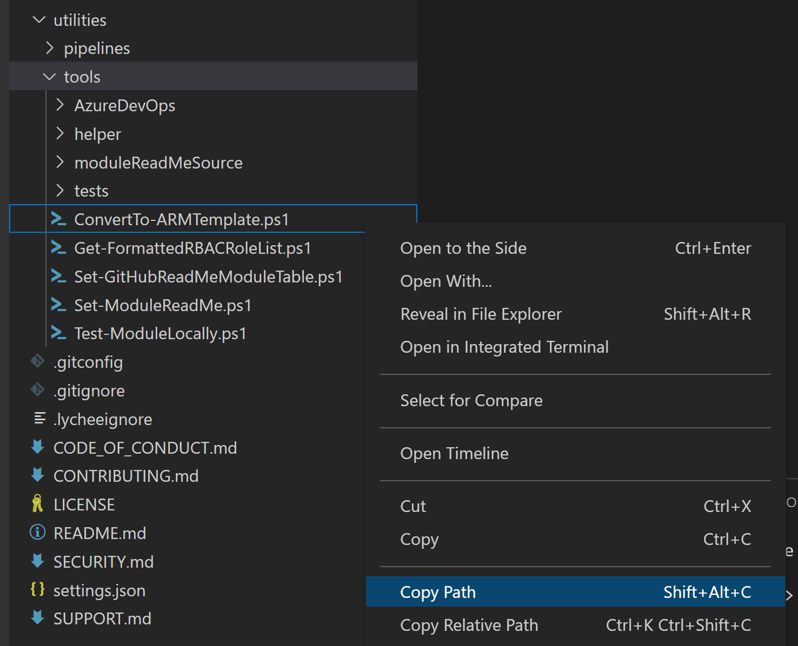
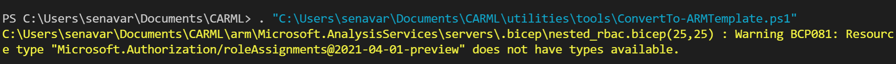

In this LAB you will explore how CARML is able to operate between ARM JSON Templates & Bicep and Azure DevOps Pipelines & GitHub Action to meet different customer scenarios.  

This is how you will run different scripts and set up a module in either ARM JSON Template or Bicep sytanx and configure a CI/CD pipeline using Azure DevOps or GitHub.

### _Navigation_
- [Step 1 - Export from Bicep to JSON Template](#Step-1---Export-from-Bicep-to-JSON-Template)
- [Step 2 - Transition to Azure DevOps Pipelines](#Step-2---Test-the-module)
---

# Step 1 - Export from Bicep to JSON Template

At this point, you have now taken CARML modules written in Bicep and deployed them using a GitHub Action written in YAML. This orchestration covers a very specific setup that may or may not meet your requirements. Some users may not be using Bicep yet and want to stick with traditional ARM JSON Templates. Thankfully, CARML allows for easy transition from Bicep to ARM Templates. 

1. As said before, you should avoid working on the main branch directly. Make sure you're located on your fork of CARML and create a new branch. For consistency, name it lab8-interoperability

1. Navigate to the `utilities/tools` folder. You will find a powershell file titled `ConvertTo-ARMTemplate.ps1`. The script allows you to do the following:
    1. Take the modules written in Bicep within your CARML library and convert them to ARM Template syntax (_Excludes children templates by default_). 
    1. Remove existing deploy.json files (_Optional_)
    1. Remove Bicep metadata from the new JSON files (_Optional_)
    1. Remove Bicep files and folders (_Optional_)
    1. Update worklfow YAML files to replace .bicep with .json so that deployments now use the newly created .json files (_Optional_)

1. To run the script, right-click on the `ConvertTo-ARMTemplate.ps1` file, and select copy path

    

1. Open a new Powershell terminal session. Type + paste into the terminal

                . "<path of script>" 

    For example:

    

    > Upon hitting enter the script will be begin running. You will notice 'Warning' as part of the output, that is normal and the script will continute. 

1. By default, the script will take all the modules found under the `arm` folder that have a `.bicep`   file, begin converting from Bicep to JSON, and conduct all the optional functions highlighted in step `2.` above. 

1. To change some of the default functionionality, the following parameters can be passed when executing the script:

            . "<path of script>" -ConvertChildren -SkipMetadataCleanup -SkipBicepCleanUp -SkipPipelineUpdate

    > This will convert top level + child bicep modules to json based ARM template, keeping metadata in json, keeping all bicep files and folders, and not updating workflows

1. Once finished, you will see that your Bicep files have now all been converted to ARM Templates. These ARM Templates will work with your existing parameter files and worflows!

# Step 2 - Transition to Azure DevOps Pipelines (Optional Lab)

Similar to Bicep, not all customers may be using GitHub and/or GitHub Actions. CARML is able to be hosted in a GitHub repo and deployed with Azure DevOps Pipelines or it can completely be ran out of Azure DevOps. The following will demonstrate how CARML can enable users to do Infrastructure-as-Code deployments with Azure DevOps Pipelines:

1. Make sure you are still located on your fork of CARML and in your `lab8-interoperability` branch

1. Navigate to the `utilities/tools/AzureDevOps` folder. You will find a powershell file titled `Register-AzureDevOpsPipeline.ps1`. The script allows you to do the following:

