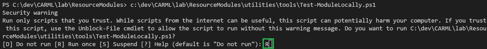
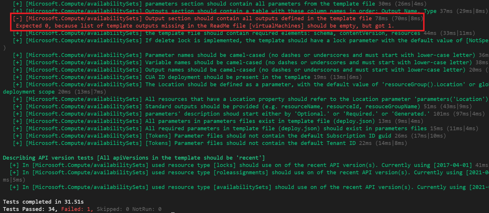
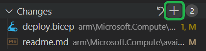
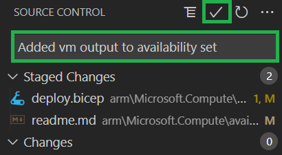
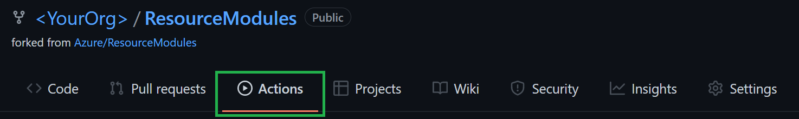
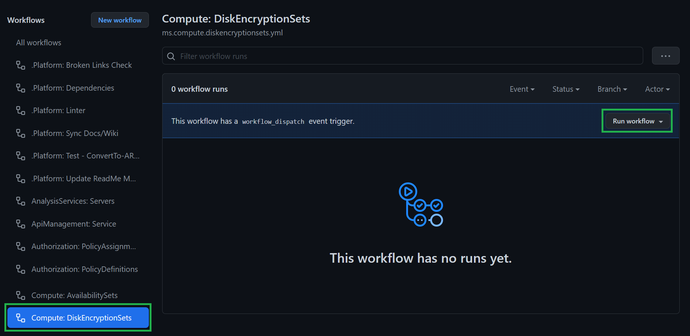
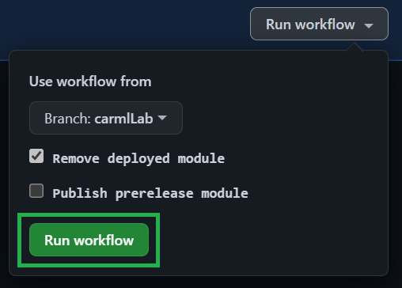
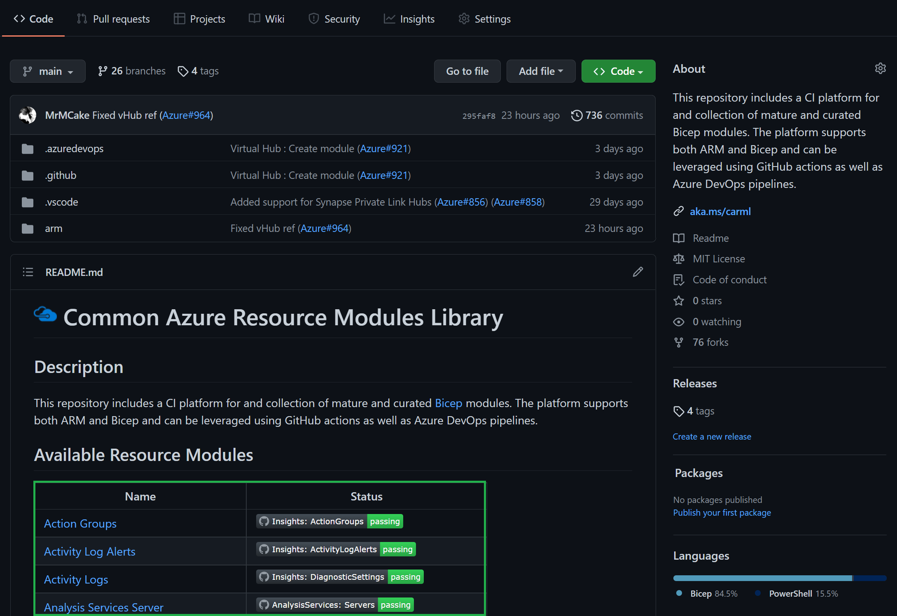

In this lab, you will learn how a contribution to the source repository (in this example the CARML main repository) would look like. At a customer, the same approach could be used to allow teams to contribute to a central library.

### _Navigation_
- [Step 1 - Implement the contribution](#step-1---implement-the-contribution)
- [Step 2 - Re-generate the documentation](#step-2---re-generate-the-documentation)
- [Step 3 - Run local test(s)](#step-3---run-local-tests)
- [Step 4 - Upload your changes and run the module pipeline](#step-4---upload-your-changes-and-run-the-module-pipeline)
- [Step 5 - Create a PR](#step-5---create-a-pr)
- [Step 6 - Cleanup unintended changes](#strep-6---cleanup-unintended-changes)
  
---

# Step 1 - Implement the contribution
<!-- E.g. update parameter metadata -->

The first step of any contribution is its implementation. For the sake if this lab, we will suggest a simple contribution that will allow you the make use of some of our tools:

1. In your local VSCode, navigate via `arm`, on to `Microsoft.Compute` and finally to the `availabilitySets`'s template `deploy.bicep`

    

1. A simple contribution to perform is the addition of an additional `output` the bicep template will return upon successful execution. As we have seen, these outputs are particularly useful when multiple modules are orchestrated together. Please add the following snippet to the end of the file: 
   
    ```bicep
    @description('A list of references to all virtual machines in the availability set.')
    output virtualMachines array = availabilitySet.properties.virtualMachines
    ```

# Step 2 - Run local test(s)

CARML comes with a number of tools that you can use to perform several automated tasks for you. One of these tools can be use to perform the same tests locally as you would see in the pipeline. To do so, please perform the following tasks:

1. Navigate navigate through the folders `utilities` and `tools` and click on the script `Test-ModuleLocally.ps1`.

    

1. Next, you must load the function implemented in the script by triggering the `Run` button to the top right of VSCode.

    

    > ***Note***: Should VSCode ask you (in the terminal) whether you are sure you want to execute the script, please confirm
    > 

2. Once confirmed, the function will be loaded and can be invoked via the command of the same name `Test-ModuleLocally`. As stated earlier, the script replicates the feeling of the pipeline. That means, it can run a simple Pester test, but also a deployment which includes a parameter file using tokens. For our purpose, please invoke the function as follows

    ```PowerShell
    $TestModuleLocallyInput = @{
        templateFilePath           = '<PathToTheUpdatedTemplate>' # Get the path via a right-click on the updated template file in VSCode & select 'Copy Path'
        PesterTest                 = $true
    }
    Test-ModuleLocally @TestModuleLocallyInput -Verbose
    ```

3. Confirm to execute the script. After a moment, the terminal will show the test cases that are executed and should show one failed test

    

    So why did it fail? Well, as per its description: The ReadMe outputs section should document all outputs defined in the template file. Before, you added a new template output, but the readme remained in its original state. 

# Step 3 - Re-generate the documentation

To update the readme, we provide another utility called `Set-ModuleReadMe`. This script again takes the template file path as an input an creates / updates almost all content of the module's readme file for you.

1. To get started you need to load the function first. Like before, load the script in path `utilities\tools\Set-ModuleReadMe.ps1`.

    

1. Next, you can invoke the function as follows

    ```PowerShell
    Set-ModuleReadMe -TemplateFilePath '<PathToTheUpdatedTemplate>' # Get the path via a right-click on the updated template file in VSCode & select 'Copy Path'
    ```

1. Once you confirmed the execution of the script you should notice that the module's `readme.md` file is marked as modified. 

    

1. If you open version control to the left you should notice at least the template file `deploy.bicep` and readme file `readme.md` to be marked as changed. If you click on the readme specifically, a comparison view will open and show you that the readme was correctly updated

    

# Step 4 - Re-Run local test(s)

With the readme updated we can now re-run the test to confirm everything is in order.

1. Select again the terminal and either use your arrow-up key go through your previous commands until the get to the one that triggered the test (`Test-ModuleLocally`), or copy the same snipped from Step 2.

    ```PowerShell
    $TestModuleLocallyInput = @{
        templateFilePath           = '<PathToTheUpdatedTemplate>' # Get the path via a right-click on the updated template file in VSCode & select 'Copy Path'
        PesterTest                 = $true
    }
    Test-ModuleLocally @TestModuleLocallyInput -Verbose
    ```

1. This time, however, none of the tests should fail:

    


# Step 5 - Upload your changes and run the module pipeline

Now that the contribution is implemented and the tests are green, you can continue prepare everything for the subsequent pull request.

1. The first thing you have to do is to upload your changes. You can do this either via the terminal or by using the Git integration of VSCode. To keep it simple, this lab assumes you want to use the VSCode git integration. If not already there, navigate to the source control menu to the left.

    

1. Here you first need to add the changed files to the commit. To do so, select the `+` icon next to `Changes` (appears when hovering)

    

1. Next, you should give the commit a meaningful message such as 'Added VM output to availability set' and can then click the checkmark symbol on the top to create the commit

    

1. Finally, you can push the changes to the repository by selecting the blue `Publish Branch` button

    

1. Back in your fork, navigate to `Actions`

    

1. From the list of actions to the left, select `Compute: DiskEncryptionSets` followed by the `Run workflow` dropdown to the right

    

1. Further select your branch from the `Branch:` dropdown

    

1. And finally trigger the pipeline with the default settings by selecting `Run workflow`
 
    

    Subsequently, the pipeline will start running through the the same tests you executed locally, but also execute the simulated deployment, followed by an actual test deployment in Azure.

1. While the pipeline is running, we can use the time to create a Pull Request. However, before doing so, you can take the chance to create a pipeline badge that you can attach to the later Pull Request. This badge will show the reviewer that the code changes were successfully validated & tested. To create a badge, first select the three dots (`...`) to the top right of the pipeline.

    


<!--
1. In your fork, navigate to the list of pipelines in the lower end of the repository overview and select the name of the `Key Vault` module in the left column

    
-->


# Step 6 - Create a PR
<!-- Attach the badge -->

# Step 7 - Cleanup unintended changes
<!-- Undo changes to e.g. global variables & settings.json -->
