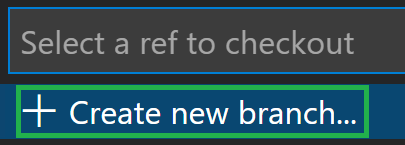
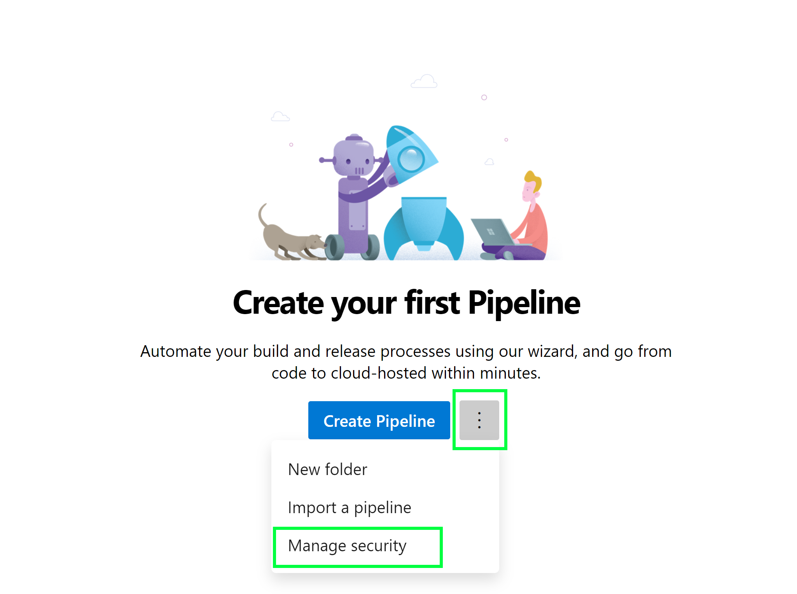
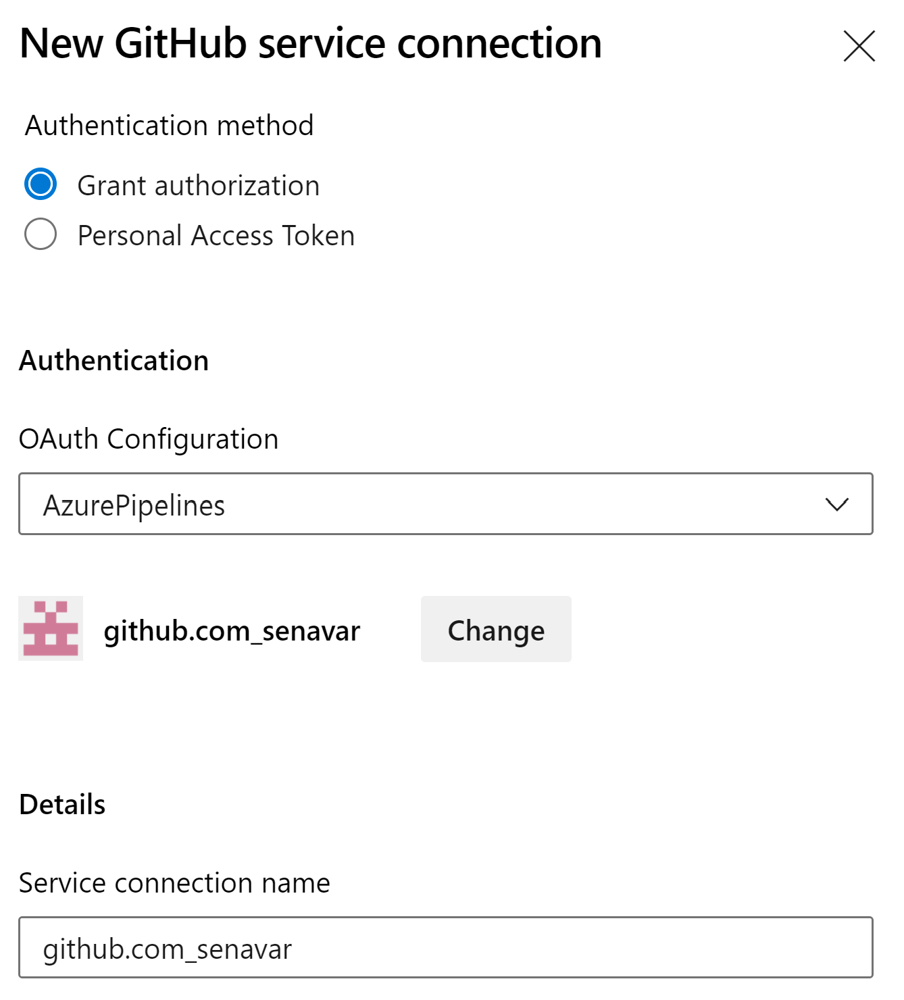

In this lab you will explore how CARML is able to operate with both ARM JSON Templates & Bicep as well as with both Azure DevOps Pipelines & GitHub Workflows to meet different customer scenarios.  

There may be reasons why a customer may not want to use Bicep or GitHub workflows just yet:
- Bicep is still a relatively new DSL and not yet version 1.0.0
- GitHub workflows are likewise relatively new compared to Azure DevOps pipelines and not yet on par with it

Fortunately, CARML supports both GitHub & Azure DevOps and either pipeline is compatible with both ARM JSON as well as Bicep.

### _Navigation_
- [Step 1 - Create a new branch](#step-1---create-a-new-branch)
- [Step 2 - Convert to ARM](#step-2---convert-to-arm)
- [Step 3 - (Optional) Leverage Azure DevOps Pipelines](#step-3---optional-leverage-azure-devops-pipelines)
---

# Step 1 - Create a new branch

First, navigate back to your local CARML fork.

To not interfere with your current setup, you should make sure to perform this lab in a dedicated branch.

You can achieve this in two ways:

 - **Alternative 1:** Via VSCode's terminal with the following steps

    1. If Terminal is not in sight, you can alternatively open it by expanding the `Terminal`-dropdown on the top, and selecting `New Terminal`
     
    1. Now, execute the following PowerShell commands:

        ```PowerShell
        git checkout -b 'usingARM'
        git push --set-upstream 'origin' 'usingARM'
        ```
 - **Alternative 2:** You can perform a few steps in the UI

    1. Select the current branch on the bottom left of VSCode

         

    1. Select `+ Create new branch` in the opening dropdown

         

    1. Enter the new branch name `usingARM`

    1. Push the new branch to your GitHub fork by selecting `Publish Branch` to the left in the 'Source Control' tab

        


# Step 2 - Convert to ARM

In this step, you will use one of CARML's utilities to convert the repository from Bicep-based to ARM-based. This includes the conversion of the templates themselves, the update of the pipelines that use them, as well as the cleanup of both metadata & redundant Bicep-specific folders.  

1. Navigate to the `utilities/tools` folder. You will find a PowerShell file titled `ConvertTo-ARMTemplate.ps1`. The script allows you to do the following:
    - Remove existing deploy.json files
    - Take the modules written in Bicep within your CARML library and convert them to ARM JSON syntax (_Excludes child-modules by default_). 
    - Remove existing deploy.json files 
    - Remove Bicep metadata from the new JSON files
    - Remove Bicep files and folders 
    - Update existing GitHub workflow as well as ADO pipeline YAML files to replace `.bicep` with `.json` so that deployments now use the newly created `.json` files 

1. First you need to load the script. There are different ways to do this, but for our purposes, right-click on the `ConvertTo-ARMTemplate.ps1` file, and select `Copy Path`.

    

1. Open an existing or new PowerShell terminal session and execute the following snippet:

    ```PowerShell
    . '<path of script>' -ConvertChildren
    
    # For example
    . 'C:/dev/Carml-lab/ResourceModules/utilities/ConvertTo-ARMTemplate.ps1' -ConvertChildren
    ``` 

    > Upon hitting enter the script will start running. You will notice several Bicep 'Warnings' as part of the output. This is normal and the script will continue. 

1. By default, the script will take all the modules found under the `arm` folder that contain a `.bicep` file, begin converting from Bicep to JSON, and conduct all the optional functions highlighted before.

1. Once finished, you will see that your Bicep files have now all been converted to ARM Templates. These ARM Templates will work with your existing parameter files and workflows!

    

# Step 3 - (Optional) Leverage Azure DevOps Pipelines

Similar to Bicep adoption, not all customers may be using GitHub repos and/or GitHub Actions. CARML is able to be hosted in a GitHub repo and deployed with Azure DevOps Pipelines or it can completely be ran out of Azure DevOps. The following will demonstrate how CARML can enable users to do Infrastructure-as-Code deployments with Azure DevOps Pipelines:

1. Before starting, make sure that you have the following:
    - Azure CLI
    - [Azure DevOps CLI extension](https://docs.microsoft.com/en-us/azure/devops/cli/?view=azure-devops)
    - An Azure DevOps Project 

1. Go to the [Azure DevOps Portal](dev.azure.com) and login.

1. To create a new DevOps project, choose the organization that you wish to create the project under. Then select `+ New Project` on the top right corner of the page. 

1. Go to your Azure DevOps project and select Pipelines on the left-hand side

    

1. Next, click the more actions `:` icon and select `Manage Security`

    

1. The pipeline permissions for the project will appear. Scroll to the bottom and find the `<ProjectName>` Build Service under `Users`. Select the Build Service. Locate the `Edit build pipeline` setting and change it from `Not Set` to `Allow`

    

    > The changes will automatically be saved/updated and you can close the permissions panel once done.

1. Next, click on `Project Setings` on the bottom-left corner of the page. Scroll towards the bottom of the `Project Settings` panel, locate the `Service Connections` tab

    

1. The next step(s) should only be done when the repo is in GitHub. We will be establishing a service connection between Azure DevOps and GitHub:
    1. Click `Create New Service Connection`
    1. Scroll, find, and select `GitHub` and click next. 

        
        
        > Note if an organization is using GitHub Enterprise to host their repository, GitHub Enterprise must be selected instead. 
    
    1. Make sure `Grant Authorization` is selected under `Authentication Method`. Then click the drop-down under `OAuth Configuration` and select `AzurePipelines`. Click Authorize

    1. A new window will appear taking you to GitHub. If you are already logged in to GitHub, it will automatically authenticate and authorize the service connection. If not, it will prompt you. Follow the steps and once finished you should see the user as part of the service connection: 

        

    1. The name of the service connection will be automatically populated. For simplicity of this lab, rename the service connection to `GithubConnection`. You will need this name later. Click save once finished.


1. You will be returned to the Service Connection settings page and should see your GitHub connection. We will now need a Service Connection between Azure DevOps and our Azure Subscription. Click on `New Service Connection` at the top right corner:
    1. Scroll, find, and select `AzureResourceManager` and click next.
    1. For this lab we will be using `Service Principal (Automatic)` which allows the Azure DevOps Service to automatically create a Service Principal in your Azure AD Tenant using a secret. Once selected click next
    1. Select `Subscription` under `Scope` and then select your target Subscription for deployments in the drop-down menu. Leave the `Resource Group` selection blank. 
    1. Name your Service Connection `AzureConnection`. You will need this later. Click save on the bottom right corner

1. You should now have two (2) Service Connections under your DevOps project, the `GithubConnection` and the `AzureConnetion`. 

1. Return to your Visual Studio Code window. Make sure you are still located on your fork of CARML and in your `lab8-interoperability` branch

1. Navigate to the `.azuredevops/pipelineVariables` folder. You will find a YAML file titled `global.variables.yml`. Open the file and update the `serviceConnection` to `AzureConnection` and save the file

1. Navigate to the `tools/AzureDevOps` folder. You will find a PowerShell file titled `Register-AzureDevOpsPipeline.ps1`. 

1. Right-click on the `ConvertTo-ARMTemplate.ps1` file, and select copy path

1. Open a new PowerShell terminal session. Type + paste into the terminal

        . "<path of script>" 

    > Upon hitting enter the script the script will not automatically run. The functions found in the script have been loaded to your Powershell session.

1. Update and copy the following code block: 

        $inputObject = @{
            OrganizationName                 = '<Name of your DevOps Organization>'
            ProjectName                      = '<Name of your DevOps Project>'
            SourceRepository                 = '<Forked Github Repo Name>'
            Branch                           = '<Name of source branch>' 
            GitHubServiceConnectionName      = 'GithubConnection'
            AzureDevOpsPAT                   = '<Placeholder>'
        }

1. Paste the code block into the PowerShell terminal and hit enter

1. Copy the following command into the PowerShell terminal:
        
            Register-AzureDevOpsPipeline @inputObject

1. Once entered the script will run and create Azure DevOps pipelines based on the YAML files you have in the `.azuredevops/modulePipelines` folder. Once finished you will be able to go to the Azure DevOps portal and see pipelines that were created as part of this process. 

1. This script is re-deployable, as all existing pipeline will not be affected. You can use this process to automatically create new pipelines for new modules/workloads!

