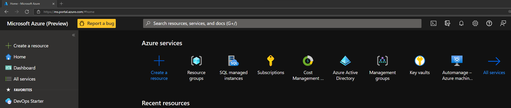
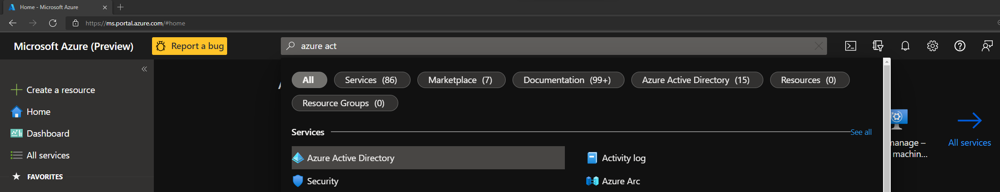
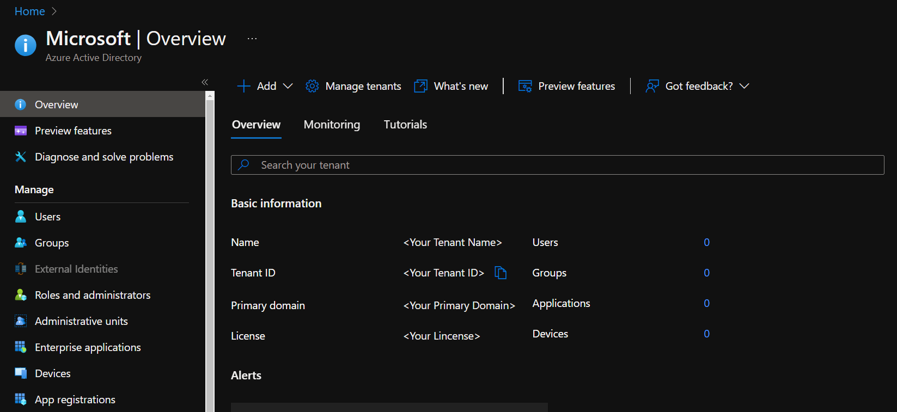
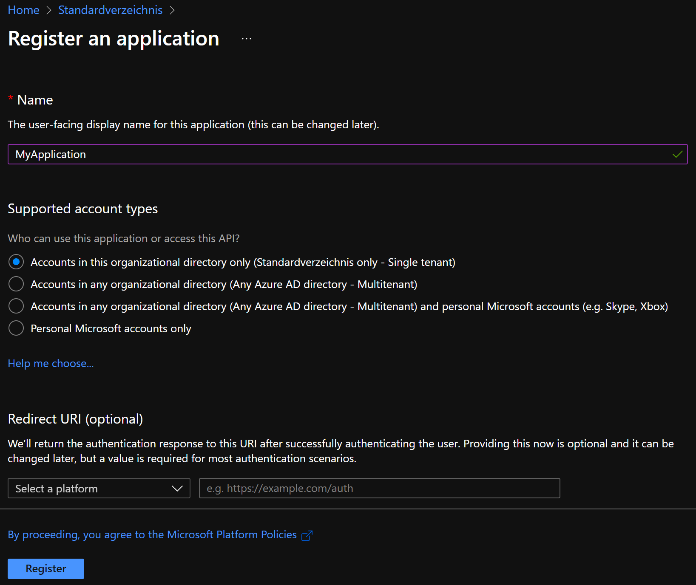
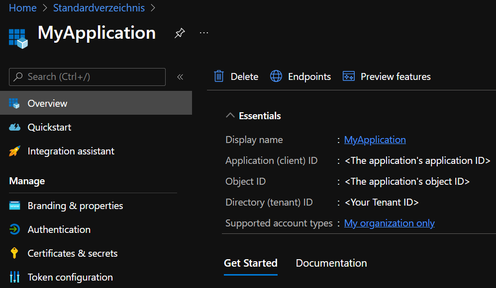
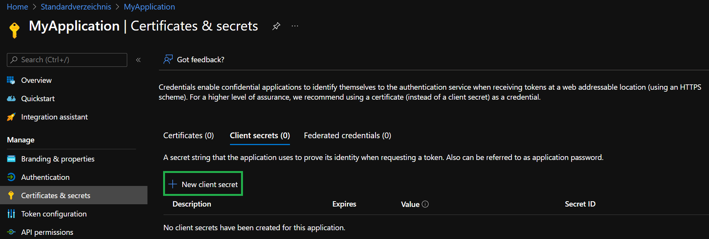

# Azure Pre-Requisites

This section outlines how to set up the pre-requisites in Azure. This includes
- Create a service principal
- Create a secret for set service principal
- Assign `Owner` permissions on a subscription

---

### _Navigation_

- [Service Principal](#actions-in-azure-ad)
- [Assign permissions](#actions-on-a-subscription)

---

# Actions in Azure AD

1. Open to the Azure Portal via [https://portal.azure.com](https://portal.azure.com)
   
   

1. Navigate to Azure Active Directory (Azure AD) by using for example the search bar on the top 

   

1. Here we want to do 2 things:
   - Make note of your `Tenant ID` in the displayed `Overview`
   - Further navigate to `App registrations` in the blade to the left      

   

1. In the opening view select `+ New registration` on the top

   

1. In the opening form, please provide a name of your choice and select `Register`. All other options can remain as is.

   

1. This will open the created application's overview. Here we again want to do 2 things:
   - Make note of the `Application (client) ID`
   - Further navigate to  `Certificates & secrets` in the blade to the left

   

1. Select `+ New client secret` in the view to the right

   

1. Now enter a name for the secret, and click on `Add`

   

1. The previous step created a new secret for the application which is shown to us now. Please make note of the secret value as it will only be visible until we leave this view.

   

# Actions on a subscription
